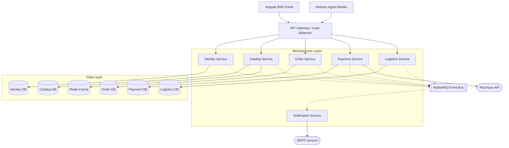
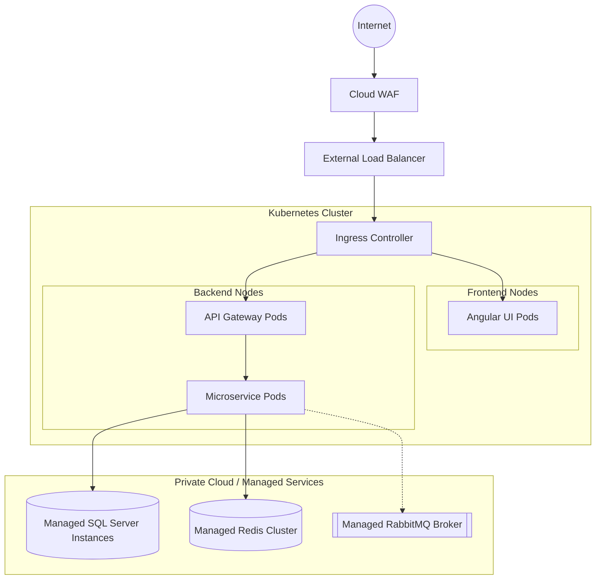
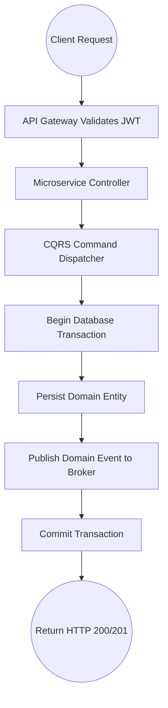
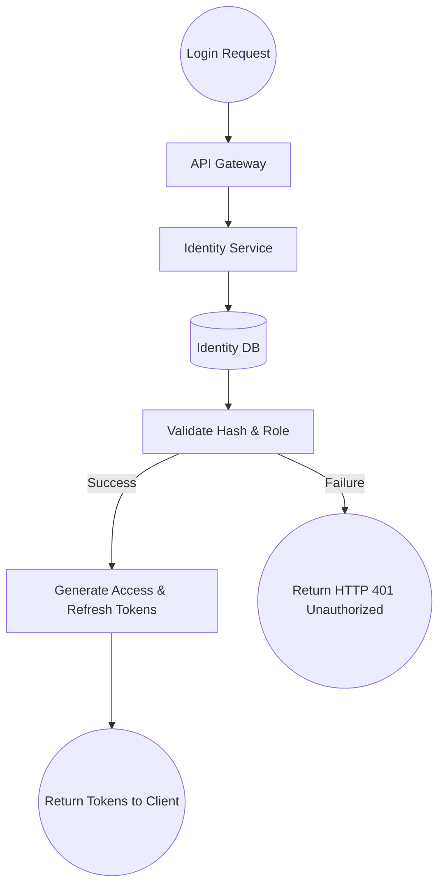
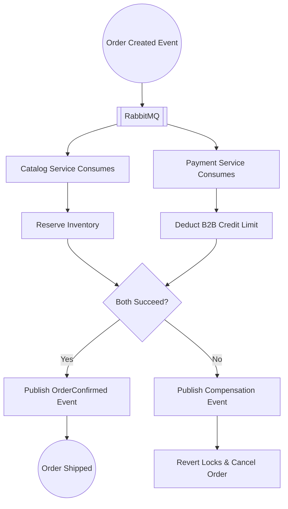
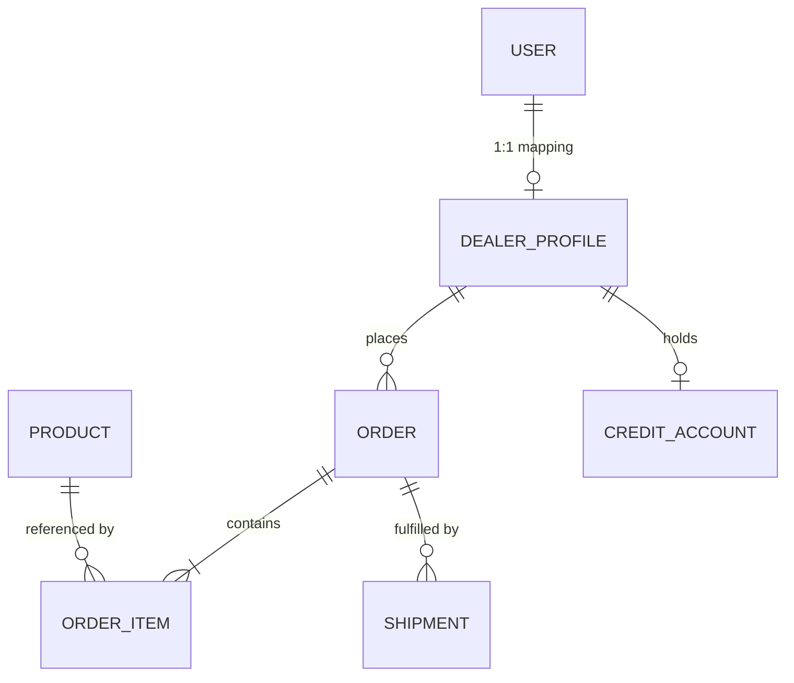

# High-Level Design (HLD) Document
**Project:** Enterprise B2B Supply Chain Platform

<div style="page-break-after: always;"></div>

## 1. System Overview

### Architectural Summary
The Enterprise B2B Supply Chain Platform is built on a distributed, event-driven microservices architecture. It decouples high-traffic domains (Catalog and Ordering) from administrative domains (Identity, Logistics, Payments) to provide a resilient, scalable backend for Fast-Moving Consumer Goods (FMCG) ecosystems. The system utilizes an API Gateway as a Backend-For-Frontend (BFF) to funnel all client traffic, while inter-service communication is handled asynchronously via a message broker.

### Key Design Decisions & Trade-Offs
- **Eventual Consistency over Strong Consistency:** Opting for asynchronous event propagation improves performance and fault tolerance but introduces a slight delay in cross-service data synchronization.
- **Database per Service:** Ensuring true decoupling at the cost of complex distributed transactions (handled via Saga choreography).
- **Read/Write Segregation (CQRS):** Separating command execution from read queries adds architectural overhead but significantly boosts read-heavy performance (e.g., catalog browsing).

---

## 2. Architecture Style

**Architecture Style:** Event-Driven Microservices

**Justification based on System Requirements:**
- **High Throughput Needs:** The system must process massive bulk B2B orders without locking the entire database. Event-driven architectures absorb traffic spikes by queuing requests.
- **Independent Lifecycles:** Allows different development teams to build, deploy, and scale the `Logistics` service independently from the `Payment` service.
- **Resilience:** If the `Notification` service goes down, the `Order` service continues to function; notification events simply queue up until the service is restored.

---

## 3. Technology Stack

| Category | Technology |
|---|---|
| **Frontend** | Angular 17, TypeScript, SCSS |
| **Backend** | .NET 8 (C#), ASP.NET Core Web API |
| **Database** | SQL Server (Relational data) |
| **Messaging / APIs** | RabbitMQ (Event Broker), REST APIs |
| **Caching** | Redis (Distributed Cache) |
| **Infrastructure / Cloud** | Docker Containers, Kubernetes (K8s) |
| **DevOps Tools** | GitHub Actions (CI/CD), Serilog (Logging) |

<div style="page-break-after: always;"></div>

## 4. System Architecture Diagram



<div style="page-break-after: always;"></div>

## 5. Component Diagram

```mermaid
flowchart LR
    subgraph API Gateway
        Routing[Path Routing]
        AuthZ[Token Validation]
    end

    subgraph Service Structure (Typical)
        API[API Endpoints]
        App[Application Layer / CQRS]
        Dom[Domain Entities]
        Infra[Infrastructure Layer]
    end

    Routing --> API
    AuthZ --> API
    
    API --> App
    App --> Dom
    App --> Infra
    
    Infra --> DB[(Local Database)]
    Infra --> Bus[[Event Bus Integration]]
```

---

<div style="page-break-after: always;"></div>

## 6. Deployment Diagram



---

<div style="page-break-after: always;"></div>

## 7. Service Flow Diagrams

### API Request Lifecycle (Write Operation)



### Authentication Flow



### Data Processing Pipeline (Asynchronous Fulfillment)



---

<div style="page-break-after: always;"></div>

## 8. Data Architecture Overview



---

## 9. Design Patterns (Architectural Level)

- **Microservices Architecture:** Decomposes the application into loosely coupled, independently deployable services organized around business capabilities.
- **CQRS (Command Query Responsibility Segregation):** Used in the application layer via MediatR to strictly separate state-mutating commands from data-fetching queries, optimizing performance and code readability.
- **Event-Driven Choreography (Saga):** Utilized for distributed transactions. Instead of a central orchestrator controlling order fulfillment, services react to RabbitMQ events to execute local transactions (e.g., locking inventory).
- **Layered Architecture (Clean Architecture):** Inside each microservice, dependencies point inward. Domain entities have no knowledge of infrastructure (Entity Framework or REST APIs).

---

## 10. Scalability & Performance Design

- **Horizontal Scaling:** The stateless microservices (deployed via Docker/Kubernetes) are designed to scale horizontally by adding more pods/containers dynamically during high load.
- **Vertical Scaling:** The relational SQL Server databases scale vertically with increased compute resources to handle complex write loads.
- **Caching Strategies:** A distributed Redis cache is placed in front of the Catalog service. Because catalog queries represent the bulk of platform read traffic, caching drastically reduces database I/O.
- **Load Handling:** The API Gateway uses Round-Robin load balancing to distribute incoming traffic evenly across healthy microservice instances.

---

## 11. Security Architecture

- **Authentication Mechanism:** The platform utilizes stateless JSON Web Tokens (JWT) issued by the Identity service. Tokens are short-lived, with secure refresh token rotation.
- **Authorization Model:** Role-Based Access Control (RBAC). Claims encoded in the JWT (e.g., `Role: Admin`, `Role: Dealer`) are inspected at the API Gateway and Service Controller levels to permit or deny execution.
- **Data Protection:** All external traffic is encrypted via HTTPS (TLS 1.2+). At the database layer, sensitive columns and passwords are mathematically hashed, and Transparent Data Encryption (TDE) is applied to data at rest.

---

## 12. Fault Tolerance & Reliability

- **Retry Strategies:** The system employs Polly-based exponential backoff and jittered retry policies for transient database errors (e.g., `DbUpdateConcurrencyException` during simultaneous inventory locks).
- **Failover Handling:** The API Gateway utilizes health checks. If a microservice pod fails, traffic is immediately routed to healthy pods. Kubernetes automatically restarts failing containers.
- **Observability Overview:** Structured logging is implemented via Serilog. Error traces and domain event logs are aggregated into centralized logging dashboards, enabling operators to trace a user request entirely through the distributed microservice cluster.
