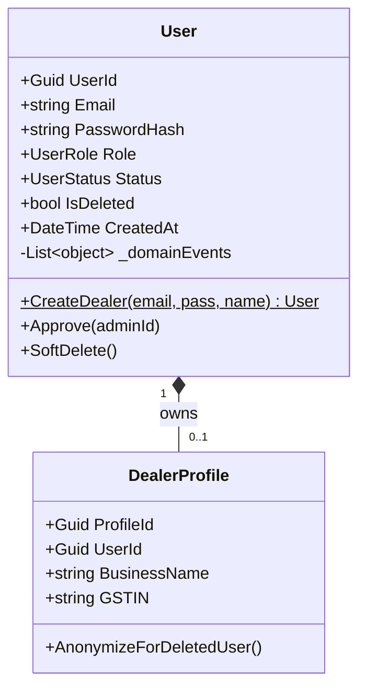
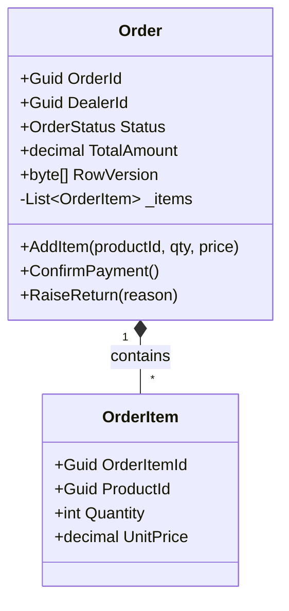
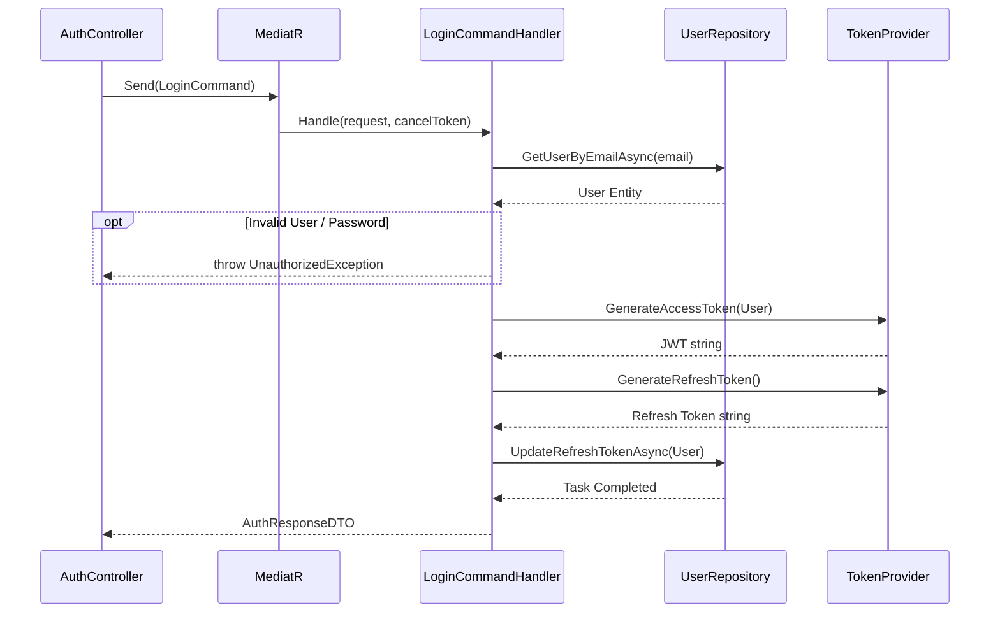
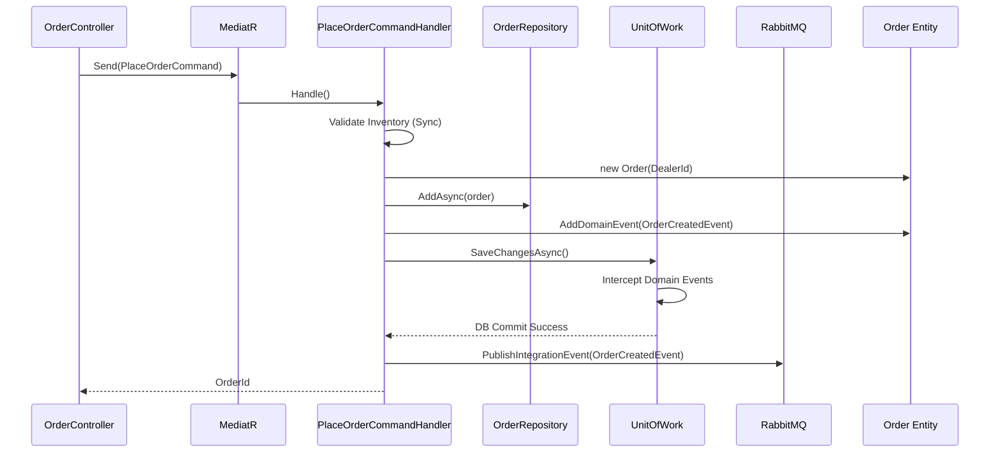
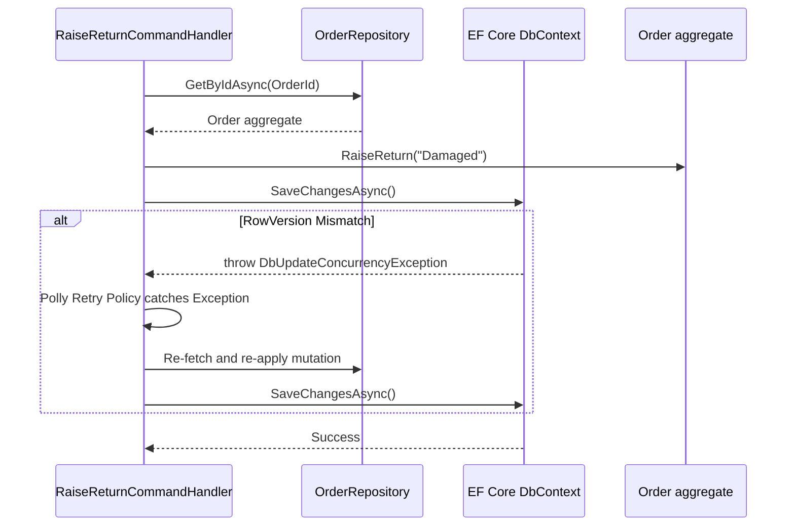
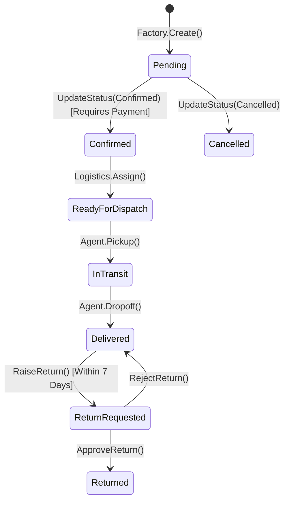
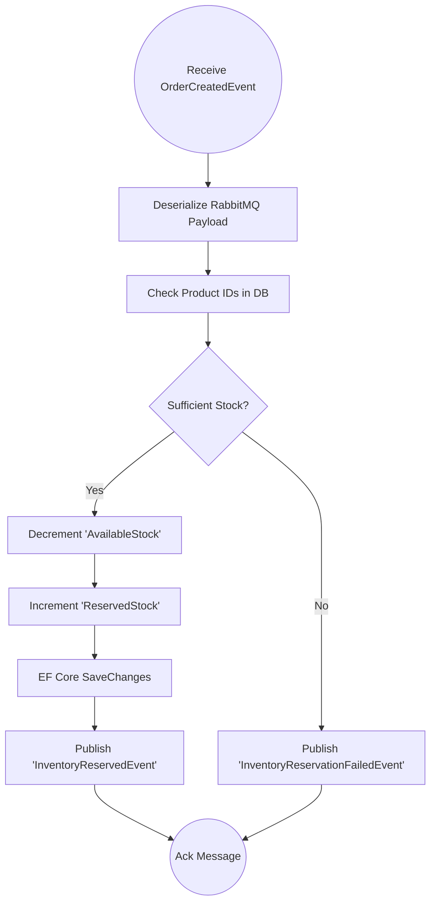

# Low-Level Design (LLD) Document
**Project:** Enterprise B2B Supply Chain Platform

<div style="page-break-after: always;"></div>

## 1. Module-Level Breakdown

### 1.1 Identity Service
- **Responsibility:** User provisioning, JWT issuance, RBAC verification, Soft-Deletion logic.
- **Interfaces:** `IAuthService`, `ITokenProvider`, `IUserRepository`.
- **Dependencies:** SQL Server (Identity Schema), BCrypt, MediatR.

### 1.2 Catalog Service
- **Responsibility:** SKU management, category hierarchies, optimistic concurrency inventory locking.
- **Interfaces:** `ICatalogRepository`, `IInventoryService`, `IRedisCacheService`.
- **Dependencies:** SQL Server (Catalog Schema), Redis, RabbitMQ Publisher.

### 1.3 Order Service
- **Responsibility:** Order saga initiation, order state machine management, return validation.
- **Interfaces:** `IOrderRepository`, `IPaymentVerificationClient`.
- **Dependencies:** SQL Server (Order Schema), RabbitMQ Consumer/Publisher, MediatR.

### 1.4 Payment Service
- **Responsibility:** B2B Credit Ledger tracking, external Razorpay webhook processing.
- **Interfaces:** `ICreditRepository`, `IRazorpayClient`, `IWebhookValidator`.
- **Dependencies:** SQL Server (Payment Schema), External Razorpay API.

<div style="page-break-after: always;"></div>

## 2. Class Diagrams

### 2.1 Identity Domain


### 2.2 Order Domain


<div style="page-break-after: always;"></div>

## 3. Sequence Diagrams (Implementation Workflows)

### 3.1 Authentication & Login (JWT Generation)


### 3.2 Place B2B Order (CQRS Write Operation)


### 3.3 Raise Return with Concurrency Handling


<div style="page-break-after: always;"></div>

## 4. API Design Specification

| Endpoint | Method | Request Schema | Response Schema | Status Codes |
|---|---|---|---|---|
| `/api/identity/login` | POST | `{ email, password }` | `{ accessToken, refreshToken }` | 200 OK, 401 Unauthorized |
| `/api/identity/users/{id}` | DELETE | `N/A` | `N/A` | 204 No Content, 403 Forbidden |
| `/api/catalog/products` | GET | `?page=1&size=50` | `{ items: [ProductDTO], total }` | 200 OK |
| `/api/orders` | POST | `{ items: [{productId, qty}] }` | `{ orderId, status }` | 201 Created, 422 Unprocessable |
| `/api/orders/{id}/return` | POST | `{ reason }` | `{ status: "ReturnRequested" }` | 200 OK, 409 Conflict |

---

## 5. Database Design (Implementation-Level)

### 5.1 Table: `Identity.Users`
| Field | Type | Constraints | Index |
|---|---|---|---|
| `UserId` | UNIQUEIDENTIFIER | PRIMARY KEY | Clustered |
| `Email` | NVARCHAR(256) | NOT NULL | Non-Clustered (Unique if Not Deleted) |
| `PasswordHash` | NVARCHAR(512) | NOT NULL | - |
| `Role` | INT | NOT NULL | - |
| `IsDeleted` | BIT | NOT NULL, DEFAULT(0) | Non-Clustered Filtered (`IsDeleted=0`) |
| `CreatedAt` | DATETIME2 | NOT NULL | - |

### 5.2 Table: `Order.Orders`
| Field | Type | Constraints | Index |
|---|---|---|---|
| `OrderId` | UNIQUEIDENTIFIER | PRIMARY KEY | Clustered |
| `DealerId` | UNIQUEIDENTIFIER | FOREIGN KEY (`Identity.Users`) | Non-Clustered |
| `Status` | NVARCHAR(50) | NOT NULL | - |
| `TotalAmount` | DECIMAL(18,2) | NOT NULL | - |
| `RowVersion` | ROWVERSION | NOT NULL | - (Used for EF Core Concurrency) |

### 5.3 Normalization & Indexing Strategy
- **Normalization:** 3NF implemented across bounded contexts. No foreign keys cross microservice database boundaries (DealerId in Order DB is a logical soft-link, not a physical FK).
- **Indexing:** Clustered indices on all GUID Primary Keys. Non-clustered filtered indices on frequently queried but soft-deleted columns (e.g., `WHERE IsDeleted = 0`).

<div style="page-break-after: always;"></div>

## 6. State Diagrams (Internal State Machine)

### Order Entity Status Transition


<div style="page-break-after: always;"></div>

## 7. Activity Diagrams (Internal Execution Flows)

### Handle Eventual Consistency for Catalog Reservation


---

## 8. Error Handling & Edge Cases

### Validation Logic
- **Request Validation:** Executed in the MediatR Pipeline using `FluentValidation` `IPipelineBehavior`. Returns HTTP 400 with a standard `ProblemDetails` JSON format containing a list of field-specific errors.
- **Domain Validation:** Entities encapsulate their own validation. Calling `User.CreateDealer()` with empty strings throws a custom `DomainException("INVALID_EMAIL")`, which an Exception Filter translates to HTTP 422.

### Concurrency Failures
- Catch `DbUpdateConcurrencyException`.
- Trigger Polly `AsyncRetryPolicy`: 3 retries with exponential backoff (e.g., `Math.Pow(2, retryAttempt)`).

---

## 9. Logging & Monitoring

### Logging Strategy (Serilog)
- **Log Levels:**
  - `Information`: API Request/Response completion, Event Published.
  - `Warning`: Validation failures, 404s, Polly Retries initiated.
  - `Error`: Unhandled exceptions, Database connection timeouts.
- **Context Enrichment:** Serilog is configured to inject `CorrelationId` and `UserId` into every log sink (Elasticsearch/Application Insights).

---

## 10. Code Structure

### Layered Folder Architecture (Per Microservice)
```text
/src/Services/Order
├── SupplyChain.Order.Api         # Controllers, Middleware, Program.cs
├── SupplyChain.Order.Application # MediatR Commands/Queries, DTOs, Behaviors
├── SupplyChain.Order.Domain      # Entities, Enums, Domain Events, Exceptions
└── SupplyChain.Order.Infrastructure
    ├── Data                      # DbContext, Migrations, EntityConfigurations
    ├── Repositories              # IOrderRepository Implementations
    └── Messaging                 # RabbitMQ Publishers/Consumers
```

---

## 11. Design Patterns (Implementation-Level)

| Pattern | Code Usage | Justification |
|---|---|---|
| **CQRS** | `IRequestHandler<PlaceOrderCommand, Guid>` | Strictly separates the EF Core write models from Dapper-based read queries. |
| **Factory Method** | `User.CreateDealer(...)` | Prevents the instantiation of invalid domain objects by encapsulating validation within the class. |
| **Repository** | `IOrderRepository.GetByIdAsync()` | Abstracts EF Core `DbContext` from the Application layer, making MediatR handlers highly testable via mocks. |
| **Decorator / Pipeline** | `ValidationBehavior<TRequest, TResponse>` | Intercepts MediatR commands globally to execute FluentValidation rules automatically before the handler runs. |
