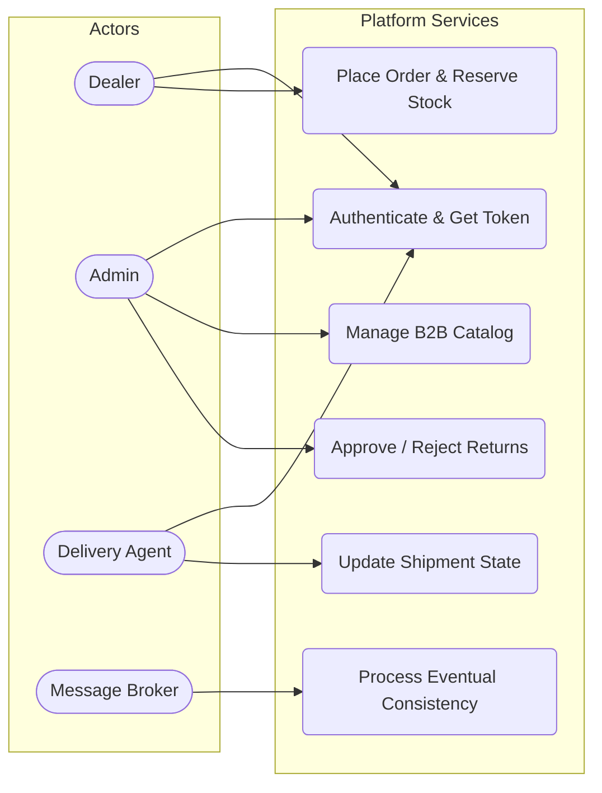
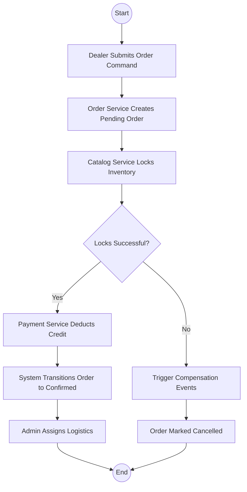
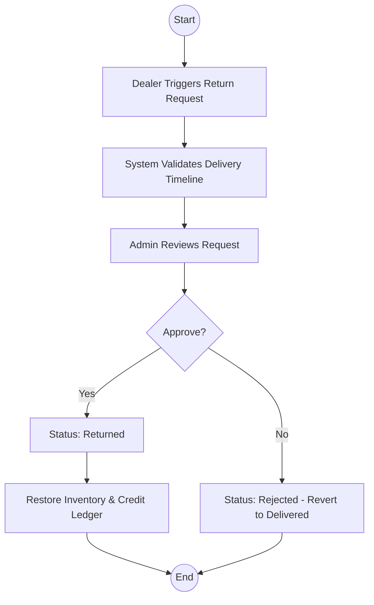
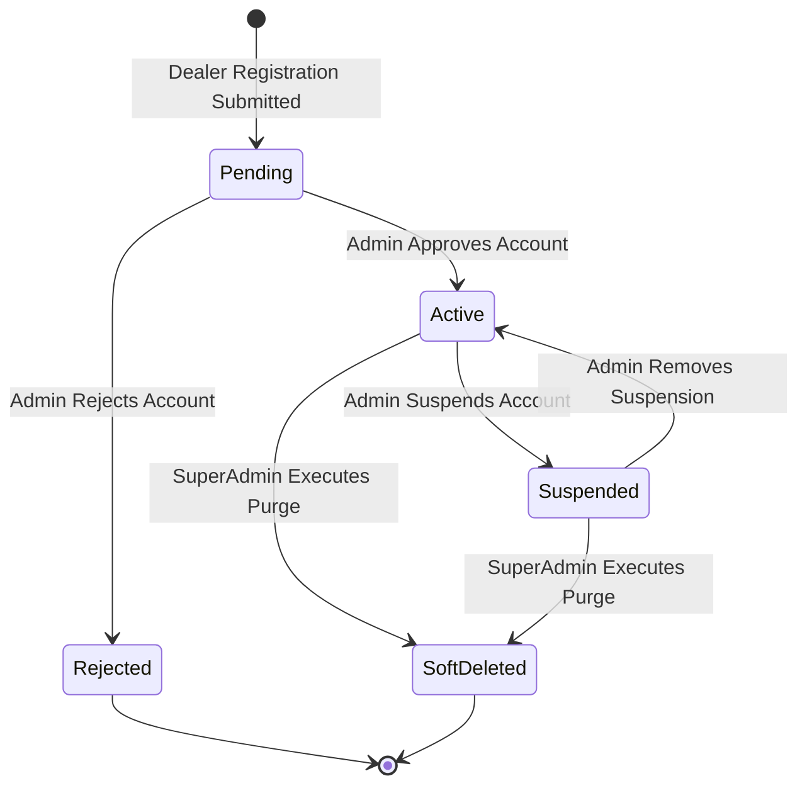
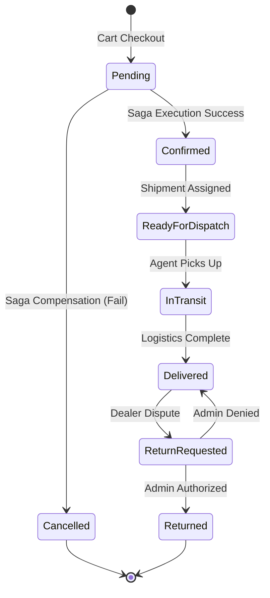

# Software Requirements Specification (SRS) & Case Study
**Project:** Enterprise B2B Supply Chain Platform

## 1. Introduction

### System Overview
The Enterprise B2B Supply Chain Platform is a distributed, multi-tenant application designed for Fast-Moving Consumer Goods (FMCG) ecosystems. It orchestrates complex business workflows across isolated bounded contexts (Identity, Catalog, Order, Payment, Logistics) using event-driven communication and command-query segregation.

### Purpose
To digitally transform traditional enterprise supply chains by providing a resilient, centralized portal for B2B dealers, administrative operators, and logistics agents. The system guarantees high-availability order processing, secure digital B2B credit management, and real-time shipment transparency.

### Scope
The platform covers user provisioning and authentication, massive-scale catalog management, pessimistic/optimistic inventory reservation, digital payments and B2B credit ledgering, end-to-end logistics tracking, and automated platform notifications.

### Definitions & Terminology
- **BFF (Backend-For-Frontend):** The API Gateway that serves as the single entry point for the Angular SPA.
- **Saga / Event Choreography:** The mechanism of completing a distributed business transaction across multiple microservices without a central orchestrator.
- **Soft Delete:** A mechanism where records are flagged as inactive (`IsDeleted`) rather than permanently destroyed, maintaining referential integrity for audits.
- **Credit Limit:** The maximum allowable deferred payment balance issued to a B2B Dealer.

---

## 2. Problem Statement

### Business Problem Being Solved
Enterprise FMCG companies face massive bottlenecks during peak wholesale seasons. Legacy monolithic ERPs lock databases during bulk order submissions, causing systemic slow-downs. Additionally, manual credit reconciliation and opaque logistics hand-offs result in delayed deliveries and high operational overhead.

### Existing Gaps in Current Systems
- **Tight Coupling:** A failure in the notification module crashes the entire order processing system.
- **Scaling Constraints:** Inability to independently scale high-traffic domains (like Catalog browsing) without wasting resources on low-traffic domains.
- **Inconsistent Data States:** Race conditions during simultaneous inventory reservations lead to overselling stock.

---

## 3. Objectives

### Business Objectives
- Automate the dealer onboarding pipeline to reduce manual approval times by 80%.
- Enable real-time inventory visibility across the entire B2B dealer network.
- Provide zero-friction payment processing using integrated B2B ledgers and external gateways.

### System Objectives
- Achieve isolated fault domains; one microservice failure must not propagate.
- Enforce Eventual Consistency using a reliable message broker for cross-service data sync.
- Support strict Role-Based Access Control (RBAC) across all exposed API endpoints.

---

## 4. Stakeholders

- **End Users (Dealers):** B2B buyers who browse the catalog, reserve inventory, place orders, and track fulfillment.
- **Admins & Super Admins:** Internal enterprise staff managing catalog data, authorizing dealer credit, handling logistics assignments, and resolving return disputes.
- **Delivery Agents:** Third-party or internal logistics personnel performing physical state transitions on shipments.
- **External Systems:** Razorpay (Payment Gateway) and SMTP/SMS Providers (Notifications).

## 5. Functional Requirements

### Identity & Access Management
- **FR-1:** The system must authenticate users via Email/Password and issue digitally signed JSON Web Tokens (JWT).
- **FR-2:** The system must enforce Role-Based Access Control (Dealer, Admin, Delivery Agent) at the API Gateway routing level.
- **FR-3:** The system must support Soft Deletion for User accounts to comply with data retention and audit policies.

### Catalog & Inventory
- **FR-4:** The system must allow Admins to execute CRUD operations on the Product Catalog.
- **FR-5:** The system must implement optimistic concurrency controls to prevent overselling stock during simultaneous order placements.
- **FR-6:** The system must automatically release locked inventory if a payment transaction fails or times out.

### Order Processing & Returns
- **FR-7:** The system must allow Dealers to submit bulk B2B orders, reserving stock in the Catalog service before confirming the order state.
- **FR-8:** The system must allow Dealers to raise a "Return Request" strictly for orders in the "Delivered" state.
- **FR-9:** The system must prevent concurrent modifications on Return Requests by implementing row-versioning validations.

### Billing & Payments
- **FR-10:** The system must deduct the total order amount from a Dealer's virtual `CreditAccount` inside a transactional boundary.
- **FR-11:** The system must securely process external payment webhooks to transition order states to "Payment Confirmed".

---

## 6. Non-Functional Requirements

- **Performance (Latency):** Catalog Read APIs must respond in under 100ms utilizing distributed caching (Redis). Order Write operations must complete within 500ms.
- **Throughput:** The event broker must be capable of processing 10,000+ domain events per second during peak Black Friday wholesale surges.
- **Scalability:** Microservices must support horizontal autoscaling triggered by CPU/Memory thresholds in a containerized orchestration environment.
- **Security:** All HTTP traffic must be encrypted via TLS 1.3. Sensitive database columns (PII, Passwords) must be hashed or encrypted at rest (TDE).
- **Reliability:** The system requires 99.9% uptime. The message broker must implement dead-letter queues to guarantee at-least-once delivery for critical events.
- **Maintainability:** The codebase must strictly adhere to Clean Architecture, segregating Domain entities from Infrastructure concerns.

## 7. Use Case Diagram

---

## 8. Detailed Use Cases

### UC-01: Dealer Registration & Approval
- **Actor:** Dealer, Admin
- **Preconditions:** Dealer provides valid business credentials.
- **Trigger:** Dealer submits the registration payload via the SPA.
- **Main Flow:**
  1. Dealer submits data. System creates a `Pending` identity aggregate.
  2. A domain event notifies the Admin portal.
  3. Admin reviews business documents and invokes the approval command.
  4. System transitions the account to `Active`.
- **Alternate Flow:** Admin rejects the application. System sets status to `Rejected` and notifies the dealer.
- **Postconditions:** The dealer can successfully authenticate and acquire a JWT.

### UC-02: Place B2B Order (Saga Execution)
- **Actor:** Dealer
- **Preconditions:** Dealer holds an `Active` session and valid JWT.
- **Trigger:** Dealer confirms the shopping cart checkout.
- **Main Flow:**
  1. Order Service creates a `Pending` order aggregate.
  2. Catalog Service is commanded to reserve inventory.
  3. Payment Service is commanded to reserve credit limit.
  4. Upon success of both, Order Service transitions to `Confirmed`.
- **Alternate Flow:** Insufficient inventory or credit. Compensation events are fired, locks are released, and the order is marked `Cancelled`.
- **Postconditions:** Order is confirmed and ready for logistics assignment.

### UC-03: Process External Payment Webhook
- **Actor:** External System (Razorpay)
- **Preconditions:** Dealer chose digital payment instead of B2B Credit.
- **Trigger:** Razorpay fires the `payment.captured` webhook.
- **Main Flow:**
  1. Gateway receives webhook and validates cryptographic signature.
  2. Payload is forwarded to Payment Service.
  3. Payment Service publishes a `PaymentConfirmedIntegrationEvent`.
  4. Order Service consumes the event and finalizes the order status.
- **Alternate Flow:** Webhook signature is invalid. System drops the request (HTTP 400).
- **Postconditions:** Financial ledgers are updated asynchronously.

### UC-04: Update Logistics State
- **Actor:** Delivery Agent
- **Preconditions:** Agent is assigned to a specific Shipment ID.
- **Trigger:** Agent scans barcode or presses "Delivered" on mobile interface.
- **Main Flow:**
  1. Agent invokes the state transition API.
  2. System validates Agent's authorization for the specific shipment.
  3. Shipment status updates to `Delivered`.
  4. An event is published triggering Dealer notification emails.
- **Alternate Flow:** Delivery attempt fails (business closed). Status updates to `Failed Attempt`.
- **Postconditions:** Order lifecycle reaches terminal delivery state.

### UC-05: Handle Concurrent Return Requests
- **Actor:** Dealer
- **Preconditions:** Order is fully `Delivered`.
- **Trigger:** Dealer submits a "Raise Return" form.
- **Main Flow:**
  1. Order Service fetches the aggregate root.
  2. Validates temporal constraints (e.g., within 7 days of delivery).
  3. Modifies status to `ReturnRequested`.
  4. EF Core attempts `SaveChangesAsync`.
- **Alternate Flow:** Another process modified the order simultaneously, triggering a concurrency exception. System applies a jittered retry policy to re-fetch and re-apply the change.
- **Postconditions:** Order is locked pending Admin return approval.

### UC-06: Admin Catalog Hydration
- **Actor:** Admin
- **Preconditions:** Admin possesses `SuperAdmin` or `Admin` JWT claims.
- **Trigger:** Admin uploads new product SKUs.
- **Main Flow:**
  1. Catalog Service validates SKU uniqueness.
  2. Products are persisted to the SQL database.
  3. System publishes a cache invalidation event.
  4. Redis cache is flushed for the affected catalog categories.
- **Alternate Flow:** Validation fails. System returns structured HTTP 422 Unprocessable Entity errors.
- **Postconditions:** New catalog items are immediately queryable by Dealers.

---

## 9. Activity Diagrams (High-Level Workflows)

### Event-Driven Order Fulfillment Flow

### Return Request Processing Flow

---

## 10. State Diagrams (High-Level Lifecycle)

### User Identity State Lifecycle

### Distributed Order Lifecycle

---

## 11. Assumptions & Constraints

### Assumptions
- External payment gateways (e.g., Razorpay) maintain high availability and timely webhook dispatching.
- Delivery agents operate in environments with intermittent internet access but will eventually sync payload data.
- Eventual consistency delays (RabbitMQ processing time) are acceptable to the business operations.

### Constraints
- **Data Deletion:** Strict compliance prohibits hard-deleting records; all relational data must use Soft-Delete query filters.
- **Architectural Boundary:** Microservices cannot query another microservice's database directly. All synchronization must occur via API Gateway proxies or asynchronous message buses.

---

## 12. Future Enhancements

- **GraphQL BFF:** Migrating from standard REST API Gateway to a GraphQL federation to minimize payload over-fetching on the Angular SPA.
- **Predictive AI Insights:** Utilizing historical order and catalog data to auto-recommend restock intervals to Dealers.
- **Transactional Outbox Implementation:** Standardizing the Outbox pattern with background polling to mathematically guarantee zero-message loss during catastrophic broker failures.
