# HUL Supply Chain Enterprise Portal - Project Documentation

Version: 1.0  
Date: 13-Apr-2026

## 1. Executive Summary

The HUL Supply Chain Enterprise Portal is a role-based B2B distribution platform built with:

- Frontend: Angular 21 + NgRx
- Backend: .NET 10 microservices using Clean Architecture and CQRS (MediatR)
- Data: SQL Server (database-per-service pattern)
- Messaging: RabbitMQ topic-based eventing
- Cache: Redis (inventory reservations, caching)
- Edge: Ocelot API Gateway

Primary actor groups:

- Dealer
- Admin
- SuperAdmin
- DeliveryAgent

Primary business domains:

- Identity and Access Management
- Product Catalog and Inventory
- Order Management and Returns
- Logistics and Delivery Tracking
- Payments and Invoice Generation
- Notifications (email + inbox)

---

## 2. Scope and Objectives

This document consolidates end-to-end implementation details for submission-ready technical review:

- Full architecture overview (frontend + backend)
- High-Level Design (HLD)
- Low-Level Design (LLD)
- UML and system diagrams
- ER/Data model diagrams
- Use case model
- API documentation summary
- Runtime topology and operations

---

## 3. Technology Stack

## 3.1 Frontend Stack

- Angular 21.2.x
- NgRx Store, Effects, Entity, DevTools
- Angular Material + CDK
- RxJS 7
- Zone.js
- Chart.js and ng2-charts

## 3.2 Backend Stack

- .NET 10 Web API
- MediatR (CQRS handlers)
- FluentValidation
- Entity Framework Core (Code-first migrations)
- Serilog
- Ocelot + Polly
- JWT bearer auth

## 3.3 Infra and Platform

- SQL Server / SQL Express
- Redis 7.4
- RabbitMQ 4 (management UI)
- Docker Compose (infra services)

---

## 4. Repository and Solution Structure

```text
Root
|- docs/
|  |- HLD.md
|  |- LLD.md
|  |- API-Contracts.md
|  |- Runbook.md
|- EnterpriseB2BSupplyChain Backend/
|  |- EnterpriseB2BSupplyChain/
|     |- src/
|        |- Gateway/
|        |- Services/
|           |- Identity/
|           |- Catalog/
|           |- Order/
|           |- Logistics/
|           |- Payment/
|           |- Notification/
|        |- SharedInfrastructure/
|- EnterpriseB2BSupplyChain Frontend/
   |- hul-supply-portal/
      |- src/app/
         |- core/
         |- features/
         |- shared/
         |- store/
```

---

## 5. High-Level Architecture (HLD)

## 5.1 System Context Diagram

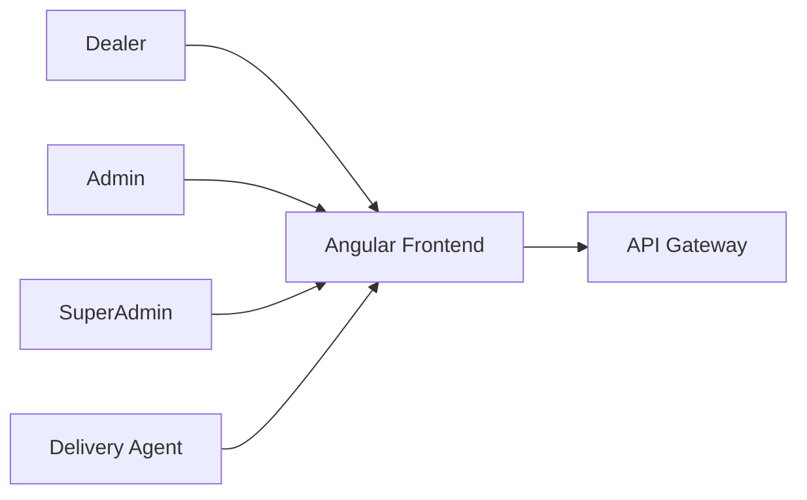

## 5.2 Container / Runtime Architecture

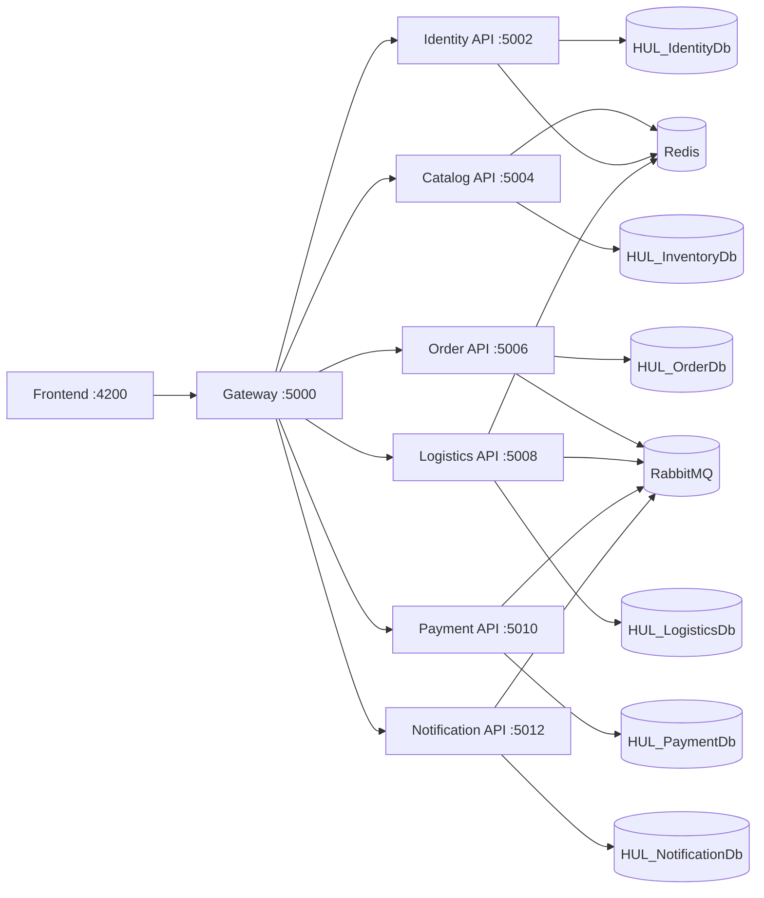

## 5.3 Service Responsibility Matrix

| Service      | Responsibility                                                                              |
| ------------ | ------------------------------------------------------------------------------------------- |
| Gateway      | Single external entry point, route mapping, auth edge, QoS policies                         |
| Identity     | Authentication, OTP, refresh tokens, dealer onboarding, user and shipping profiles          |
| Catalog      | Product/category management, stock state, favorites, stock subscriptions, reservation flows |
| Order        | Order aggregate lifecycle, status transitions, returns, outbox event publishing             |
| Logistics    | Shipment generation, agent/vehicle assignment, live tracking and SLA monitoring             |
| Payment      | Purchase-limit validation, reserve/release, invoice generation and export                   |
| Notification | Event-driven email dispatch, template management, user inbox and delivery logs              |

## 5.4 Architectural Principles

- Database-per-service (strict bounded contexts)
- Clean Architecture per microservice
- CQRS with MediatR handlers
- Event-driven async integration for cross-domain side effects
- Idempotent consumers using ConsumedMessages
- Standardized response envelope and middleware stack

---

## 6. Backend Low-Level Design (LLD)

## 6.1 Internal Layering Pattern per Service

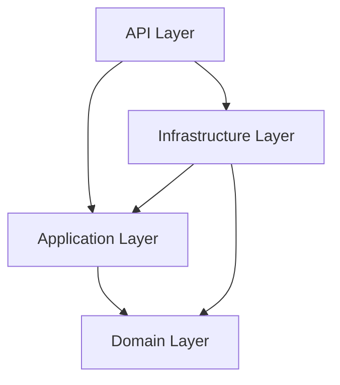

### Layer Responsibilities

- API: Controllers, request binding, auth/role gates, HTTP contracts
- Application: Commands, Queries, Validators, Handlers, orchestration logic
- Domain: Entities, value/state rules, invariants, state transitions
- Infrastructure: DbContext, repository implementations, messaging, external clients

## 6.2 Request Processing Pipeline

1. Correlation middleware
2. Rate limiting
3. Request context enrichment
4. Exception handling middleware
5. CORS
6. Serilog request logging
7. Authentication + Authorization
8. Controller endpoint execution
9. Response envelope standardization

## 6.3 SharedInfrastructure Reuse

Cross-service shared package provides:

- correlation id propagation
- standard response/result contracts
- exception-to-error mapping
- internal JWT policy helpers
- common HttpClient resilience policies
- shared Serilog bootstrap

## 6.4 Database Contexts and Aggregate Roots

### IdentityDbContext

- Users
- DealerProfiles
- RefreshTokens
- OtpRecords
- ShippingAddresses

### CatalogDbContext

- Products
- Categories
- StockSubscriptions
- FavoriteProducts

### OrderDbContext

- Orders
- OrderLines
- StatusHistories
- ReturnRequests
- OutboxMessages

### LogisticsDbContext

- Shipments
- DeliveryAgents
- Vehicles
- TrackingEvents
- ConsumedMessages

### PaymentDbContext

- Invoices
- InvoiceLines
- CreditAccounts (Dealer purchase-limit)
- PurchaseLimitHistory
- PaymentRecords
- ConsumedMessages

### NotificationDbContext

- EmailTemplates
- NotificationLogs
- NotificationInbox
- ConsumedMessages

## 6.5 UML Class Diagram - Key Domain Model

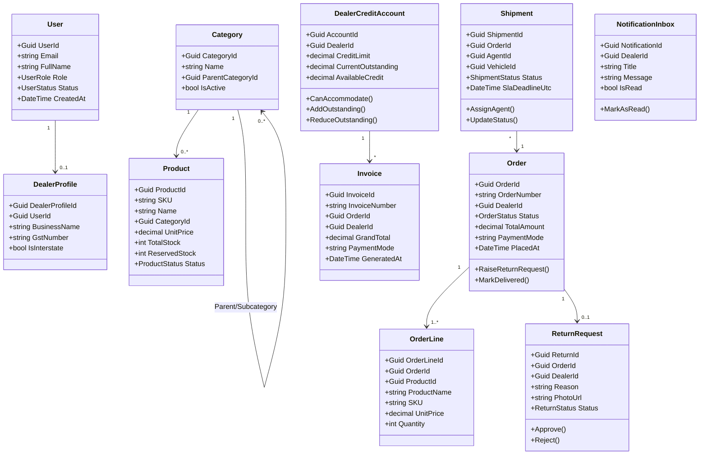

---

## 7. Frontend Architecture and LLD

## 7.1 Frontend Modules and Roles

Feature modules:

- auth
- dealer
- admin
- logistics
- agent
- super-admin
- unauthorized

Route guards:

- AuthGuard
- RoleGuard

Role mapping:

- dealer routes -> Dealer
- admin routes -> Admin, SuperAdmin
- logistics routes -> Admin, SuperAdmin
- agent routes -> DeliveryAgent
- super-admin routes -> SuperAdmin

## 7.2 Frontend App-Level Architecture

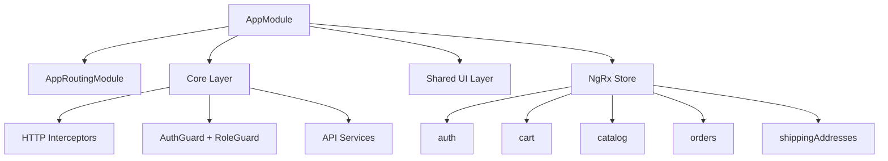

## 7.3 Interceptor Chain

1. ZoneInterceptor
2. AuthInterceptor (Bearer token injection)
3. ResponseEnvelopeInterceptor
4. ErrorInterceptor

## 7.4 Frontend Sequence (Representative)

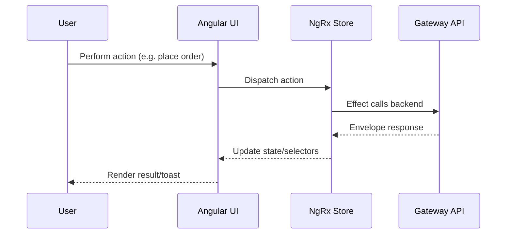

---

## 8. Event-Driven Architecture

## 8.1 Event Envelope

```json
{
  "eventId": "guid",
  "eventType": "OrderDelivered",
  "occurredAt": "utc timestamp",
  "correlationId": "trace-id",
  "source": "service-name",
  "payload": {}
}
```

## 8.2 Primary Events

- OrderReadyForDispatch
- AgentAssigned
- ShipmentStatusUpdated
- OrderDelivered
- InvoiceGenerated
- OrderCancelled
- ReturnRequested
- ReturnApproved
- ReturnRejected

## 8.3 Outbox + Inbox Reliability Pattern

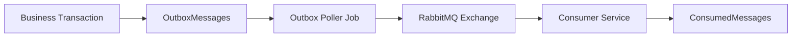

Behavior:

- Producer persists event in same DB transaction as business update.
- Poller publishes to RabbitMQ with routing key mapping.
- Consumer checks ConsumedMessages for idempotency.
- On failure, retry with capped attempts; then DLQ.

---

## 9. Use Case Model

## 9.1 Use Case Diagram (UML-style)

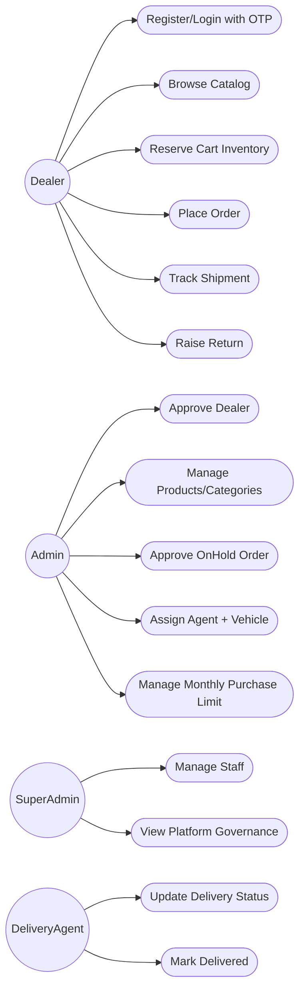

## 9.2 Core Use Case Narratives

### UC: Place Order

- Actor: Dealer
- Preconditions: Authenticated dealer, valid cart items, sufficient purchase-limit
- Main flow:
  - Reserve inventory
  - Submit order
  - Order service validates and creates order aggregate
  - Payment reserve/eligibility invoked
  - Status transitions to Processing or OnHold based on policy
- Postconditions: Order persisted; outbox events may be generated for downstream processing

### UC: Return Approval

- Actor: Admin
- Preconditions: Return status pending; request within policy window
- Main flow:
  - Admin approves return
  - Order updates return state
  - Stock restore and purchase-limit release invoked
  - ReturnApproved event emitted
  - Notification service sends email/inbox update
- Postconditions: Return closed as approved with side effects completed

---

## 10. Data Architecture and ER Diagrams

## 10.1 Cross-Service Data Ownership

- Identity owns user identity, dealer profile, auth artifacts, addresses
- Catalog owns products/categories/stock-related metadata
- Order owns order aggregate and outbox
- Logistics owns shipment and tracking timeline
- Payment owns credit account, payment records, invoice aggregate
- Notification owns templates/logs/inbox

## 10.2 Consolidated ER Diagram

```mermaid
erDiagram
    ID_USERS ||--o| ID_DEALER_PROFILES : has
    ID_USERS ||--o{ ID_REFRESH_TOKENS : owns
    ID_USERS ||--o{ ID_OTP_RECORDS : receives
    ID_USERS ||--o{ ID_SHIPPING_ADDRESSES : has

    CAT_CATEGORIES ||--o{ CAT_PRODUCTS : classifies
    CAT_CATEGORIES ||--o{ CAT_CATEGORIES : parent_of
    CAT_PRODUCTS ||--o{ CAT_FAVORITE_PRODUCTS : favorited_in
    CAT_PRODUCTS ||--o{ CAT_STOCK_SUBSCRIPTIONS : subscribed_in

    ORD_ORDERS ||--|{ ORD_ORDER_LINES : contains
    ORD_ORDERS ||--o| ORD_RETURN_REQUESTS : may_have
    ORD_ORDERS ||--o{ ORD_STATUS_HISTORIES : transitions
    ORD_ORDERS ||--o{ ORD_OUTBOX_MESSAGES : emits

    LOG_SHIPMENTS ||--o{ LOG_TRACKING_EVENTS : tracks
    LOG_DELIVERY_AGENTS ||--o{ LOG_SHIPMENTS : assigned_to
    LOG_VEHICLES ||--o{ LOG_SHIPMENTS : used_by

    PAY_INVOICES ||--|{ PAY_INVOICE_LINES : contains
    PAY_DEALER_CREDIT_ACCOUNTS ||--o{ PAY_PURCHASE_LIMIT_HISTORY : audited_by
    PAY_DEALER_CREDIT_ACCOUNTS ||--o{ PAY_PAYMENT_RECORDS : utilized_by

    NOTI_EMAIL_TEMPLATES ||--o{ NOTI_NOTIFICATION_LOGS : rendered_by
    NOTI_NOTIFICATION_INBOX ||--o{ NOTI_NOTIFICATION_LOGS : related_to

    ID_USERS {
      guid UserId PK
      string Email
      string FullName
      string Role
      string Status
    }

    CAT_PRODUCTS {
      guid ProductId PK
      string SKU
      string Name
      guid CategoryId FK
      decimal UnitPrice
      int TotalStock
      int ReservedStock
      string Status
    }

    ORD_ORDERS {
      guid OrderId PK
      string OrderNumber
      guid DealerId
      string Status
      decimal TotalAmount
      datetime PlacedAt
    }

    LOG_SHIPMENTS {
      guid ShipmentId PK
      guid OrderId
      guid AgentId
      guid VehicleId
      string Status
      datetime SlaDeadlineUtc
    }

    PAY_INVOICES {
      guid InvoiceId PK
      string InvoiceNumber
      guid OrderId
      guid DealerId
      decimal GrandTotal
      datetime GeneratedAt
    }

    NOTI_NOTIFICATION_INBOX {
      guid NotificationId PK
      guid DealerId
      string Title
      string Type
      bool IsRead
      datetime CreatedAt
    }
```

## 10.3 Important Data Integrity Rules

- One dealer profile per user
- Unique SKU per product
- One return request per order
- One invoice per order idempotency key
- DeliveryAgent.UserId unique mapping
- Consumer idempotency via (MessageId, Consumer)

---

## 11. API Documentation Summary

## 11.1 API Gateway and Base URLs

- Gateway: http://localhost:5000
- Identity: http://localhost:5002
- Catalog: http://localhost:5004
- Order: http://localhost:5006
- Logistics: http://localhost:5008
- Payment: http://localhost:5010
- Notification: http://localhost:5012

## 11.2 Contract Standards

- Protocol: HTTP JSON
- Auth: JWT Bearer
- Correlation header: X-Correlation-ID
- Standard response envelope with success/data/error/correlationId/traceId/timestamp

## 11.3 Major Endpoint Groups

### Identity

- POST /api/auth/register
- POST /api/auth/register/verify-otp
- POST /api/auth/login
- POST /api/auth/login/verify-otp
- POST /api/auth/refresh
- POST /api/auth/forgot-password
- POST /api/auth/forgot-password/reset
- CRUD /api/shipping-addresses

### Catalog

- GET/POST/PUT/DELETE /api/products
- GET/POST/PUT /api/categories
- POST /api/inventory/reserve
- POST /api/inventory/release
- POST /api/inventory/release-all
- POST /api/inventory/restock

### Order + Returns

- POST /api/orders
- GET /api/orders/my
- GET /api/orders
- PUT /api/orders/{id}/approve
- PUT /api/orders/{id}/cancel
- PUT /api/orders/{id}/ready-for-dispatch
- PUT /api/orders/{id}/in-transit
- PUT /api/orders/{id}/delivered
- POST /api/orders/{id}/returns
- GET /api/returns/my
- GET /api/returns
- PUT /api/returns/{id}/approve
- PUT /api/returns/{id}/reject

### Logistics

- POST /api/logistics/shipments
- GET /api/logistics/shipments/pending
- GET /api/logistics/shipments
- GET /api/logistics/shipments/mine
- POST /api/logistics/shipments/assign-agent
- PUT /api/logistics/shipments/{orderId}/status
- GET /api/logistics/tracking/{orderId}
- POST /api/logistics/shipments/{id}/rate

### Payment

- GET /api/payment/dealers/{dealerId}/purchase-limit-check
- GET /api/payment/dealers/{dealerId}/purchase-limit-account
- POST /api/payment/dealers/{dealerId}/purchase-limit-account
- PUT /api/payment/dealers/{dealerId}/purchase-limit
- POST /api/payment/invoices/generate
- GET /api/payment/invoices
- GET /api/payment/invoices/{invoiceId}
- GET /api/payment/invoices/{invoiceId}/download
- GET /api/payment/admin/sales/export

### Notification

- GET /api/notifications/templates
- PUT /api/notifications/templates/{eventType}
- GET /api/notification/inbox
- GET /api/notification/unread-count
- PUT /api/notification/{id}/mark-read
- PUT /api/notification/mark-all-read

## 11.4 Representative Request/Response Example

### Place Order

Request:

```json
{
  "dealerId": "ignored-at-api-layer",
  "paymentMode": "Credit",
  "items": [
    {
      "productId": "f8b2f4be-2ac8-44bc-8fc0-74fd4ed2bc1e",
      "quantity": 12
    }
  ],
  "shippingAddressId": "f4e3267e-b8dd-44cf-8c0d-99e5a38356f3"
}
```

Success envelope:

```json
{
  "success": true,
  "data": {
    "orderId": "guid",
    "orderNumber": "ORD-2026-00042",
    "status": "Processing"
  },
  "error": null,
  "correlationId": "corr-id",
  "traceId": "trace-id",
  "timestamp": "2026-04-13T10:10:00Z"
}
```

---

## 12. Core Business Flow Diagrams

## 12.1 Authentication + OTP + Refresh

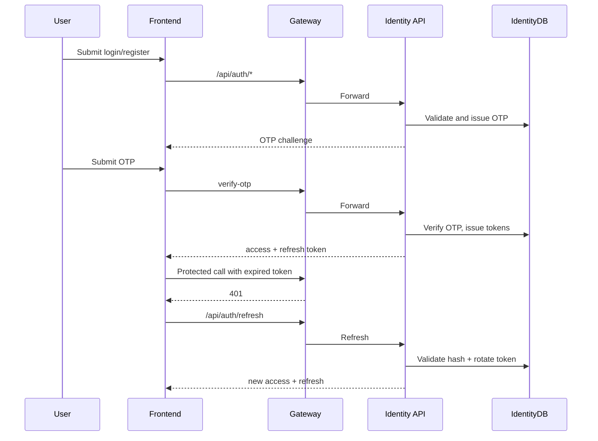

## 12.2 Order to Delivery to Invoice

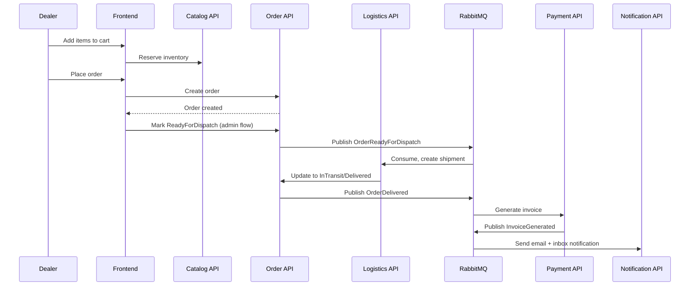

## 12.3 Return Approval Flow

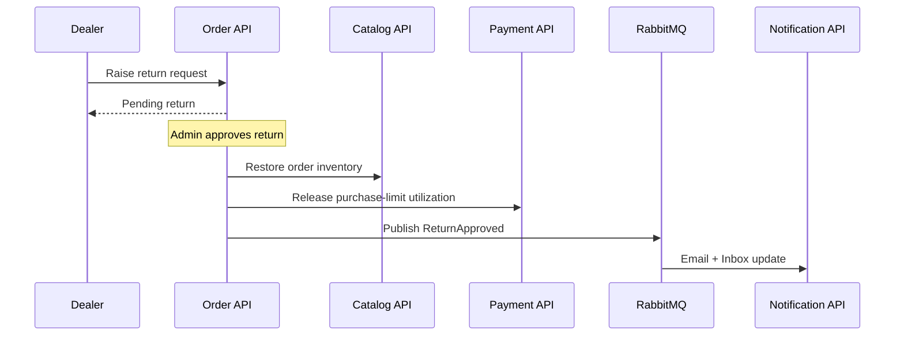

---

## 13. Deployment and Runtime View

## 13.1 Local Port Map

| Component     |  Port |
| ------------- | ----: |
| Frontend      |  4200 |
| Gateway       |  5000 |
| Identity      |  5002 |
| Catalog       |  5004 |
| Order         |  5006 |
| Logistics     |  5008 |
| Payment       |  5010 |
| Notification  |  5012 |
| Redis         |  6379 |
| RabbitMQ AMQP |  5672 |
| RabbitMQ Mgmt | 15672 |

## 13.2 Startup Automation

Backend startup script performs:

- force stop existing listeners on service ports
- launch all service projects via dotnet run

Infrastructure docker-compose provisions:

- Redis container
- RabbitMQ container (+ management UI)

---

## 14. Security and Compliance Notes

- JWT bearer auth at gateway/service level
- Role-based authorization in controllers
- Internal endpoints protected by internal-service policy claims
- Ownership checks in dealer-facing operations
- Refresh token rotation and revocation
- Correlation ids for traceability and auditing

---

## 15. Observability and Reliability

## 15.1 Logging and Tracing

- Shared Serilog configuration across services
- Request logs include correlation metadata
- Correlation propagated through HTTP and event envelopes

## 15.2 Resilience

- Ocelot QoS + Polly policies (timeouts/circuit behavior)
- Outbox event publishing for eventual consistency
- Consumer idempotency and dead-letter strategy

## 15.3 Operational Health

- Health endpoints per service: /health
- Build and runtime checks in runbook

---

## 16. HLD and LLD Traceability Checklist

This document covers all required submission dimensions:

- Frontend architecture: module, store, interceptor, guard, role routing
- Backend architecture: microservices, clean layers, CQRS, data ownership
- UML diagrams: class + sequence + component flow
- ER diagrams: consolidated cross-service model
- Use case diagram: actor to business capabilities
- HLD: context/container/deployment
- LLD: request pipeline, domain internals, consumer behavior
- API documentation: endpoint groups and contract standards

---

## 17. Conclusion

The platform is an enterprise-ready microservice architecture designed for B2B supply-chain execution with strong separation of concerns, reliable async orchestration, and role-governed business workflows. It supports complete flows from dealer onboarding to order fulfillment, invoicing, returns, and notifications with consistent technical patterns across services.

This ProjectDoc can be used as the primary submission artifact for architecture, implementation, and API-level review.
