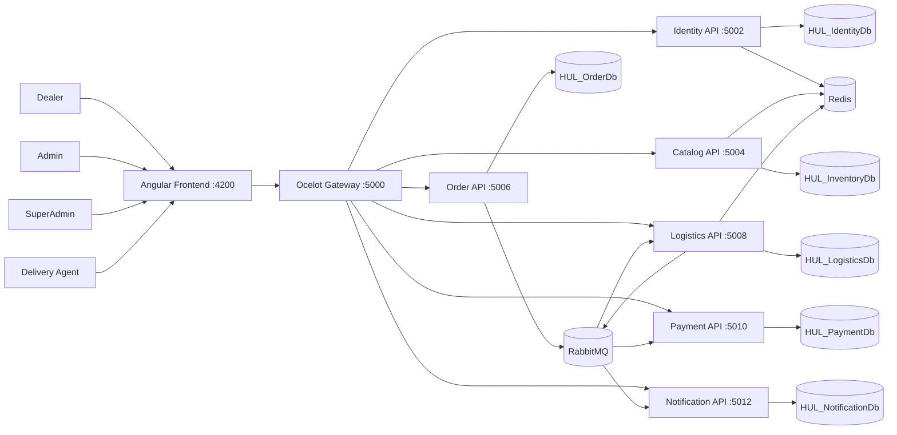
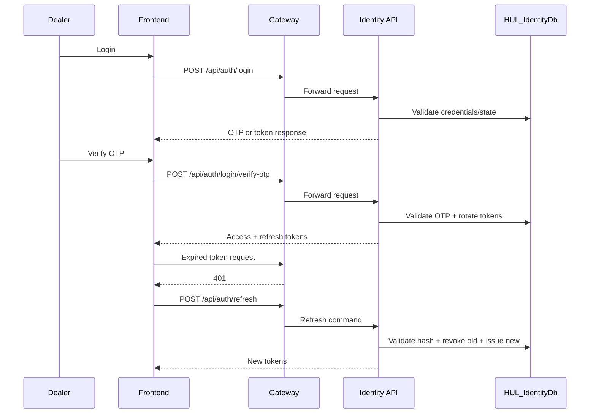
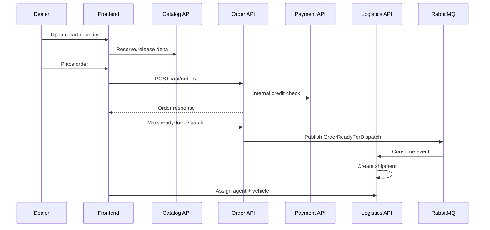
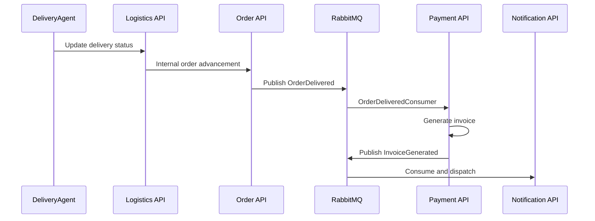

# HUL Supply Chain Enterprise Portal

[](#frontend)
[](#backend)
[](#backend-architecture)
[](#event-driven-architecture)
[](#cross-cutting-concerns)

Enterprise B2B supply chain platform for distributor operations, built with Angular and .NET microservices.  
The system is designed around bounded contexts, CQRS application flows, and reliable async integration patterns.

---

## Table of Contents

- [Documentation Package](#documentation-package)
- [Platform Scope](#platform-scope)
- [System Architecture](#system-architecture)
- [Service Landscape](#service-landscape)
- [Backend Architecture](#backend-architecture)
- [Frontend](#frontend)
- [Event-Driven Architecture](#event-driven-architecture)
- [Security Model](#security-model)
- [Cross-Cutting Concerns](#cross-cutting-concerns)
- [Data Architecture](#data-architecture)
- [Core Business Workflows](#core-business-workflows)
- [Runtime Topology](#runtime-topology)
- [Local Development](#local-development)
- [Repository Structure](#repository-structure)
- [Operational Notes](#operational-notes)

---

## Documentation Package

Detailed technical documents are available in [`docs/`](./docs/):

- [High-Level Design](./docs/HLD.md)
- [Low-Level Design](./docs/LLD.md)
- [API Contracts](./docs/API-Contracts.md)
- [Operational Runbook](./docs/Runbook.md)

---

## Platform Scope

Primary domains:

- identity and access management
- product catalog and inventory orchestration
- order lifecycle and returns
- logistics dispatch and delivery tracking
- payments and invoicing
- customer and operational notifications

Primary roles:

- Dealer
- Admin
- SuperAdmin
- DeliveryAgent

---

## System Architecture



---

## Service Landscape

| Service | Responsibility | Port | Database |
|---|---|---:|---|
| Gateway | Routing, auth edge, policy gateway | 5000 | N/A |
| Identity | Auth, OTP, user lifecycle, shipping addresses | 5002 | HUL_IdentityDb |
| Catalog | Products, categories, favorites, reservation support | 5004 | HUL_InventoryDb |
| Order | Orders, status transitions, returns, outbox | 5006 | HUL_OrderDb |
| Logistics | Shipment orchestration, assignment, tracking | 5008 | HUL_LogisticsDb |
| Payment | Credit validation, invoice generation | 5010 | HUL_PaymentDb |
| Notification | Email templates, dispatch, inbox | 5012 | HUL_NotificationDb |

---

## Backend Architecture

### Service Internal Layers

Each microservice follows the same clean layering model:

- `API` for transport concerns and endpoint contracts
- `Application` for use cases (commands/queries/handlers/validators)
- `Domain` for entities, enums, and invariants
- `Infrastructure` for persistence and external integrations

### Application Patterns

- Clean Architecture
- CQRS + MediatR
- FluentValidation pipeline behaviors
- async domain integration via events
- idempotent consumer strategy with inbox dedupe

### Shared Infrastructure

`src/SharedInfrastructure/SupplyChain.SharedInfrastructure` centralizes:

- global exception mapping middleware
- correlation ID middleware and HTTP propagation handlers
- standard API result contracts and error models
- shared Serilog bootstrap and request-context enrichment
- shared HttpClient resilience policies (Polly)
- internal-service JWT helpers
- request rate limiting
- API response envelope filter

---

## Frontend

Angular application:

- feature-oriented module structure by role/domain
- NgRx store slices for auth/catalog/cart/orders/shipping
- interceptor pipeline for:
  - token injection
  - refresh and retry behavior
  - response contract normalization
  - centralized error handling

---

## Event-Driven Architecture

### Standard Event Envelope

```json
{
  "eventId": "guid",
  "eventType": "OrderDelivered",
  "occurredAt": "utc timestamp",
  "correlationId": "trace id",
  "source": "service-name",
  "payload": {}
}
```

### Reliability Controls

- transactional outbox in order domain
- inbox dedupe (`ConsumedMessages`) in consumers
- bounded retry strategy
- dead-letter queue routing for poison/failing events

---

## Security Model

- JWT-based authentication and authorization
- internal service policy for internal endpoints
- audience and issuer validation across services
- ownership checks on domain-sensitive operations
- hashed refresh tokens with rotation and revocation

---

## Cross-Cutting Concerns

### Observability

- Serilog console and file sinks
- contextual enrichment:
  - `CorrelationId`
  - `UserId`
  - `ServiceName`
  - `RequestPath`
- correlation propagation through HTTP and event metadata
- retention cleanup for logs

### Resilience

- Ocelot + Polly integration for retries, timeout, circuit breaker
- safe fallback behavior in payment-dependent transitions
- middleware-first global exception handling

### API Contract

All APIs follow a consistent envelope contract:

```json
{
  "success": true,
  "data": {},
  "error": null,
  "correlationId": "string",
  "traceId": "string",
  "timestamp": "utc timestamp"
}
```

---

## Data Architecture

### HUL_IdentityDb

- `Users`
- `DealerProfiles`
- `OtpRecords`
- `RefreshTokens`
- `ShippingAddresses`

### HUL_InventoryDb

- `Products`
- `Categories`
- `FavoriteProducts`
- `StockSubscriptions`

### HUL_OrderDb

- `Orders`
- `OrderLines`
- `OrderStatusHistory`
- `ReturnRequests`
- `OutboxMessages`

### HUL_LogisticsDb

- `Shipments`
- `DeliveryAgents`
- `Vehicles`
- `TrackingEvents`
- `ConsumedMessages`

### HUL_PaymentDb

- `DealerCreditAccounts`
- `Invoices`
- `InvoiceLines`
- `PaymentRecords`
- `ConsumedMessages`

### HUL_NotificationDb

- `EmailTemplates`
- `NotificationInbox`
- `NotificationLogs`
- `ConsumedMessages`

---

## Core Business Workflows

### Authentication and Refresh



### Order to Dispatch



### Delivery to Invoice to Notification



---

## Runtime Topology

| Component | Port |
|---|---:|
| Frontend | 4200 |
| Gateway | 5000 |
| Identity API | 5002 |
| Catalog API | 5004 |
| Order API | 5006 |
| Logistics API | 5008 |
| Payment API | 5010 |
| Notification API | 5012 |

SQL Server target: `.\SQLEXPRESS`

---

## Local Development

### Prerequisites

- .NET SDK 10
- Node.js + npm
- SQL Server / SQL Express
- Redis
- RabbitMQ

### Build Backend

```powershell
dotnet build "EnterpriseB2BSupplyChain Backend/EnterpriseB2BSupplyChain/EnterpriseB2BSupplyChain.slnx" --configuration Release -v minimal
```

### Run Frontend

```powershell
cd "EnterpriseB2BSupplyChain Frontend/hul-supply-portal"
npx ng serve
```

### Validate Frontend Production Bundle

```powershell
npx ng build --configuration production
```

### Infrastructure Bootstrap (Redis + RabbitMQ)

```powershell
cd "EnterpriseB2BSupplyChain Backend/EnterpriseB2BSupplyChain"
docker compose up -d
```

---

## Repository Structure

```text
d:\Early Sprint
|-- EnterpriseB2BSupplyChain Backend/
|   |-- EnterpriseB2BSupplyChain/
|       |-- src/
|           |-- Gateway/
|           |-- SharedInfrastructure/
|           |-- Services/
|               |-- Identity/
|               |-- Catalog/
|               |-- Order/
|               |-- Logistics/
|               |-- Payment/
|               |-- Notification/
|
|-- EnterpriseB2BSupplyChain Frontend/
|   |-- hul-supply-portal/
```

---

## Operational Notes

- Current local compose scope includes infrastructure services (Redis, RabbitMQ).
- CI/CD and full-stack container orchestration are intentionally outside current repository scope.
