# Enterprise-B2B-Supply-Chain-Platform - All Diagrams (A4 Friendly)

This version is simplified for PDF export:

- Short labels
- Lower node density
- One diagram block per section
- Page-break marker after each section

---

## 1) ER Diagram (Simplified)

### 1.1 Core Business Tables

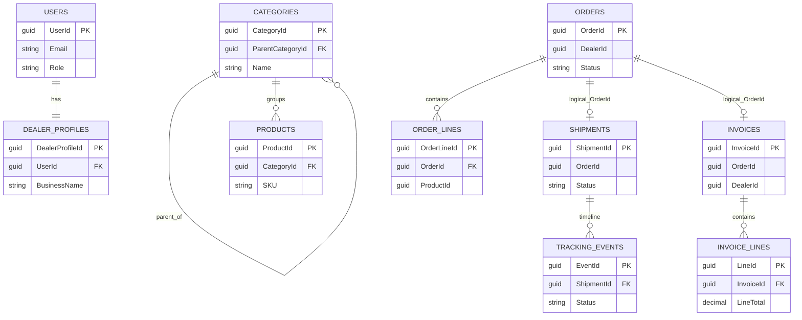

### 1.2 Integration and Support Tables

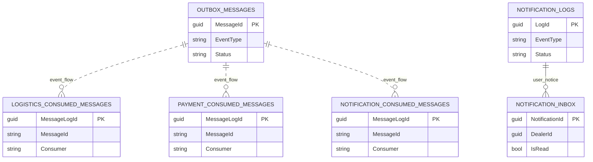

<!-- pagebreak -->

---

## 2) Component Diagram

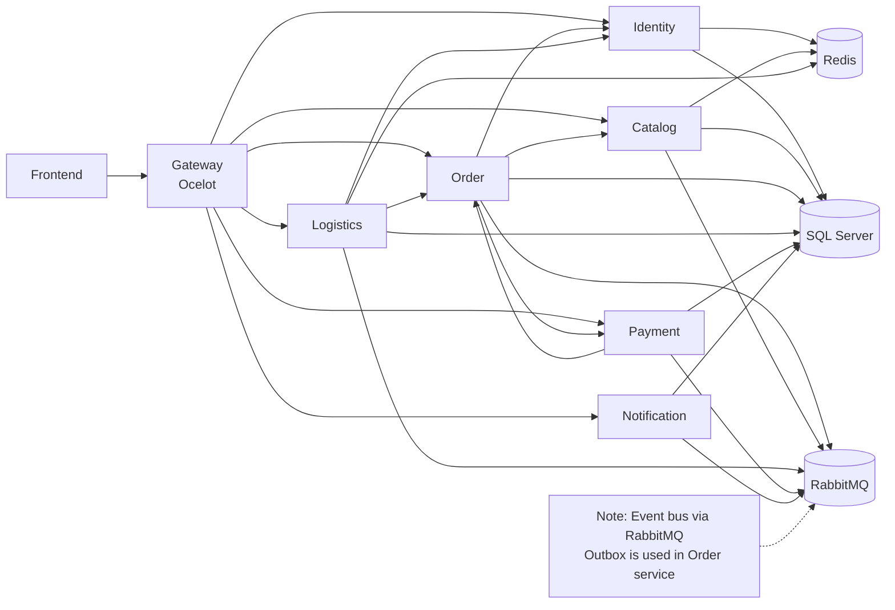

<!-- pagebreak -->

---

## 3) Use Case - Super Admin

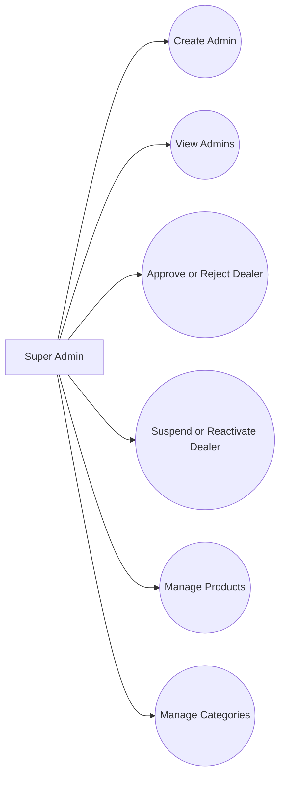

<!-- pagebreak -->

---

## 4) Use Case - Dealer

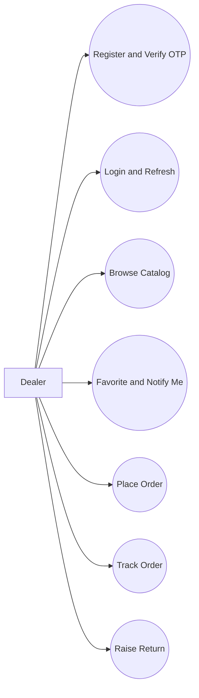

<!-- pagebreak -->

---

## 5) Use Case - Delivery Agent

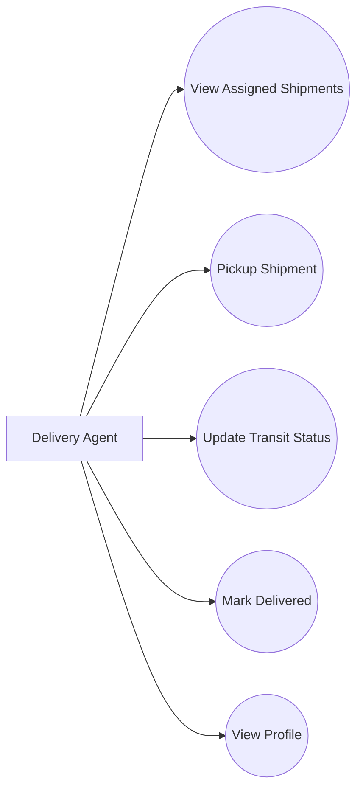

<!-- pagebreak -->

---

## 6) Sequence - Order Placement

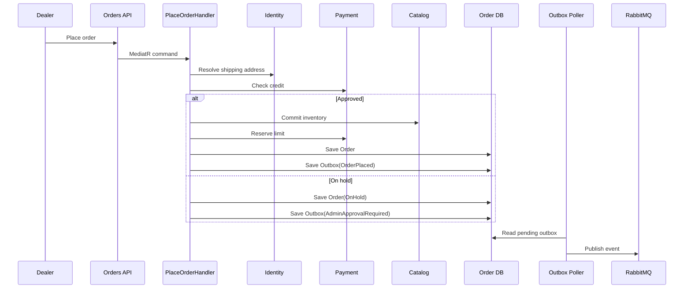

<!-- pagebreak -->

---

## 7) Sequence - Logistics Assignment

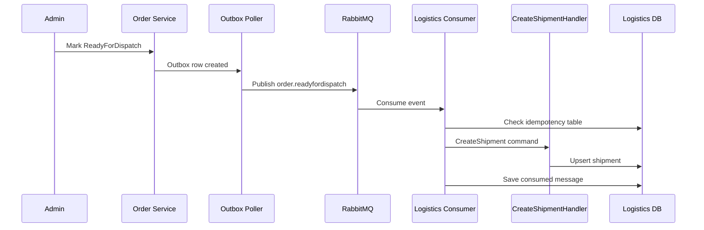

<!-- pagebreak -->

---

## 8) Sequence - Delivery Completion

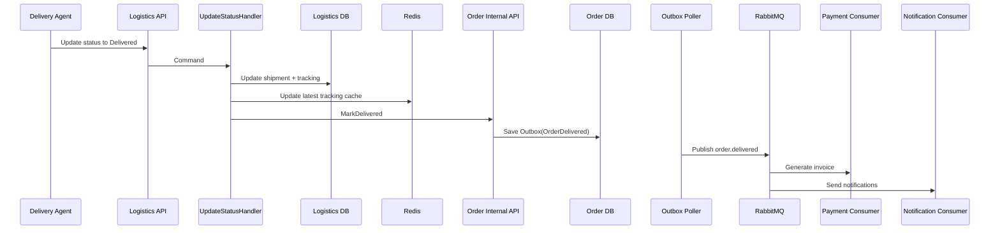

<!-- pagebreak -->

---

## 9) Class Diagram (Core + Application)

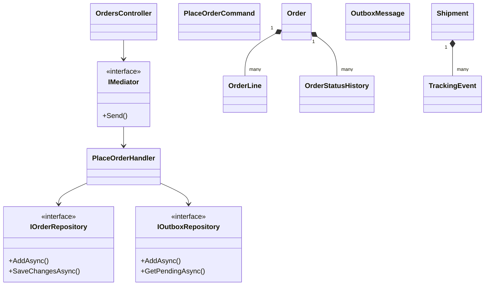

<!-- pagebreak -->

---

## 10) State Diagram (Order + Consignment)

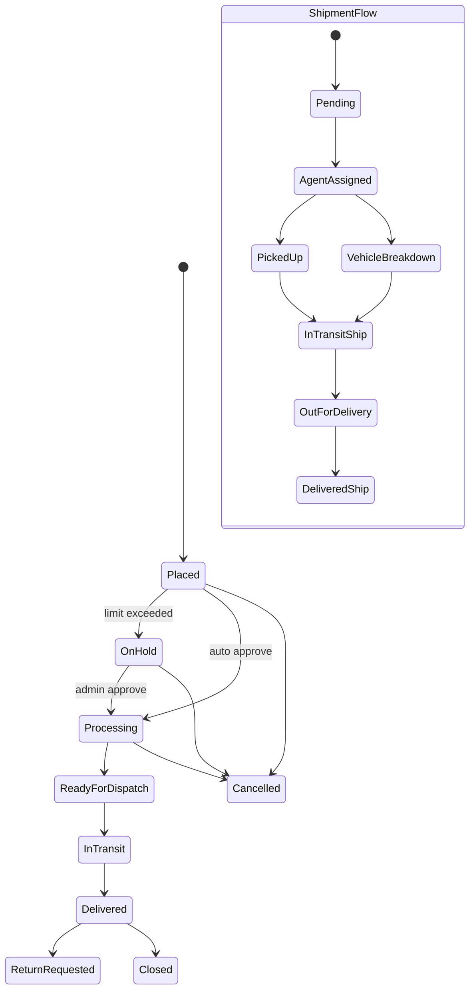

<!-- pagebreak -->

---

## 11) Activity Diagram (Dealer Places Order)

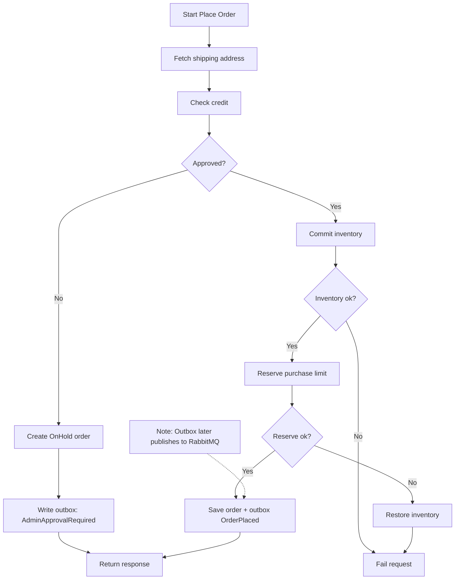

<!-- pagebreak -->

---

## 12) Service Flow (RabbitMQ Event Map)

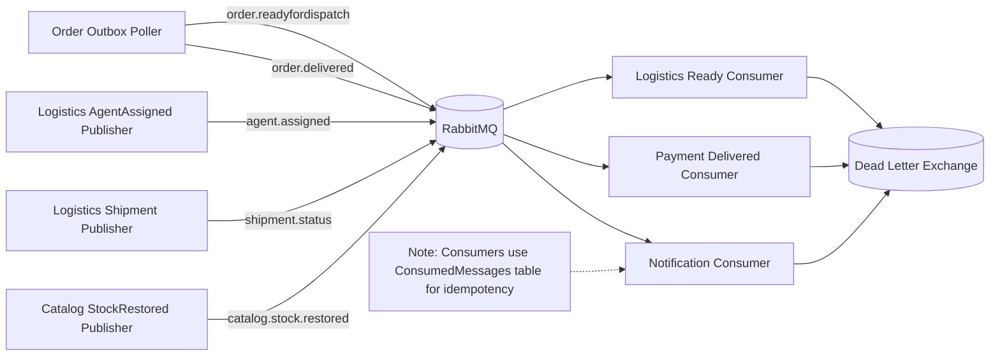

<!-- pagebreak -->

---

## Notes

- Messaging: RabbitMQ topic exchange.
- Reliability: Order outbox + consumer dedupe + retry/DLQ.
- Cache: Redis is used for live tracking and selected caching paths.
