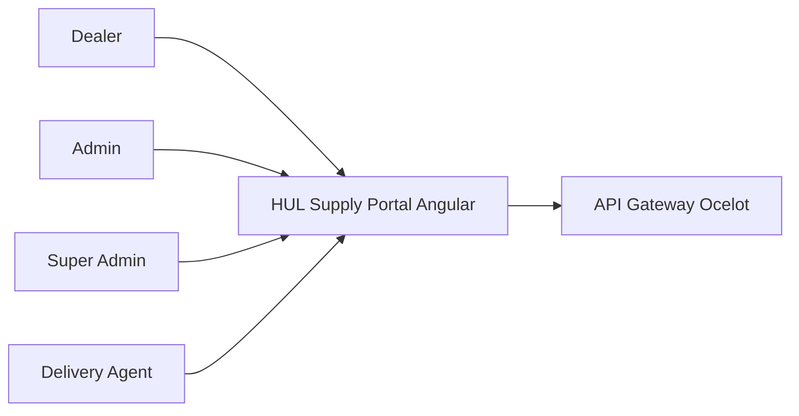
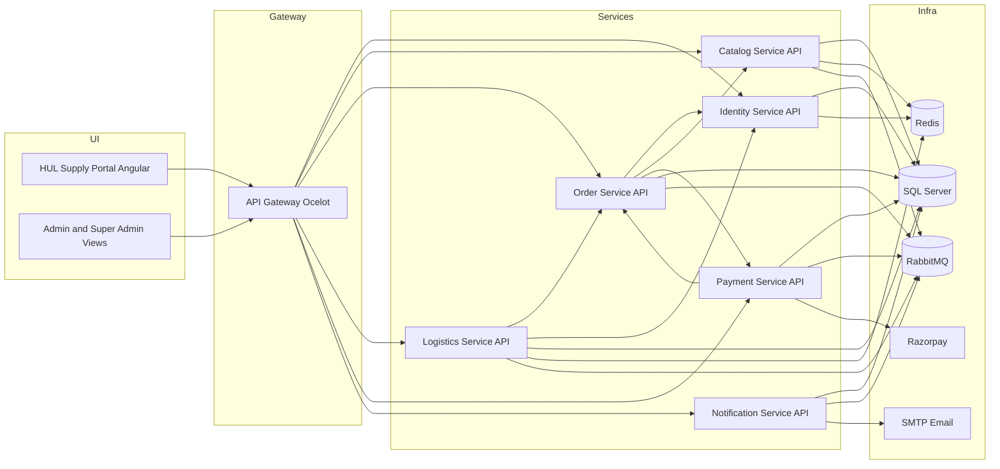
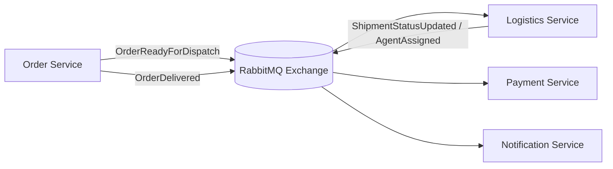

# High-Level Design (HLD)

## 1. Purpose

This document explains the macro architecture of the Enterprise B2B Supply Chain platform, focused on:

- business capability decomposition
- service boundaries and responsibilities
- integration topology (sync and async)
- deployment/runtime shape and platform concerns

---

## 2. Architecture Summary

The platform is implemented as a domain-aligned microservice system behind an API gateway.

- Frontend: Angular portal for Dealer, Admin, Super Admin, and Delivery Agent personas
- Edge: Ocelot gateway as a single API entry point
- Core services: Identity, Catalog, Order, Logistics, Payment, Notification
- Data and messaging: SQL Server, Redis, RabbitMQ
- External integrations: Razorpay and SMTP email provider

---

## 3. Architectural Principles

- Bounded context ownership per service
- Database per service to preserve autonomy
- API-first contracts for synchronous operations
- Event-driven integration for cross-domain side effects
- Shared cross-cutting infrastructure for consistency (logging, correlation, envelope, resilience)

---

## 4. System Context

---

## 5. Component Architecture

---

## 6. Service Ownership Matrix

| Service      | Owns Data                                                                    | Key Responsibilities                                        | Produces / Consumes Events                    |
| ------------ | ---------------------------------------------------------------------------- | ----------------------------------------------------------- | --------------------------------------------- |
| Identity     | Users, DealerProfiles, ShippingAddresses, RefreshTokens                      | Auth, OTP, dealer governance, account policy                | Consumes selected internal requests           |
| Catalog      | Products, Categories, Inventory state, Favorites                             | Product and category management, stock reservation/release  | Emits and consumes inventory-related messages |
| Order        | Orders, OrderItems, Returns, OutboxMessages                                  | Order lifecycle, return workflow, outbox publication        | Produces order lifecycle events               |
| Logistics    | Shipments, TrackingEvents, DeliveryAgents, Vehicles, ConsumedMessages        | Dispatch, assignment, tracking, shipment status transitions | Consumes order events, emits shipment updates |
| Payment      | PurchaseLimitAccounts, Invoices, ConsumedMessages                            | Credit checks, purchase limits, invoice generation/export   | Consumes delivery events                      |
| Notification | NotificationTemplates, NotificationInbox, NotificationLogs, ConsumedMessages | Email delivery, inbox updates, template management          | Consumes domain events                        |

---

## 7. Integration Architecture

### 7.1 Synchronous Interactions

- Frontend calls gateway upstream routes
- Gateway forwards to downstream service APIs
- Internal service-to-service HTTP used where immediate consistency is needed

### 7.2 Asynchronous Interactions

- RabbitMQ topic exchange propagates domain events
- Order service uses outbox polling to publish reliably
- Consumer services maintain dedupe tables for idempotent processing

---

## 8. Security and Trust Model

- Gateway is the main external security boundary
- JWT Bearer authentication protects role-based APIs
- Internal APIs use service policy and internal token validation
- Correlation and trace metadata propagate across HTTP and messaging boundaries

---

## 9. Runtime and Deployment View

| Component    | Port | Runtime Role                  |
| ------------ | ---: | ----------------------------- |
| Frontend     | 4200 | Angular SPA                   |
| Gateway      | 5000 | API gateway and routing       |
| Identity     | 5002 | Identity and access domain    |
| Catalog      | 5004 | Product and inventory domain  |
| Order        | 5006 | Order and returns domain      |
| Logistics    | 5008 | Shipment and tracking domain  |
| Payment      | 5010 | Purchase limits and invoicing |
| Notification | 5012 | Notifications and templates   |

Platform dependencies:

- SQL Server (`.\SQLEXPRESS` in local setup)
- Redis (cache and transient state)
- RabbitMQ (event bus)

---

## 10. Observability and Operations

- `X-Correlation-ID` is propagated for request and event tracing
- Structured logging with Serilog across services
- Shared response envelope improves operability and diagnostics
- Health endpoints support smoke checks and automation

---

## 11. Key Architectural Decisions

- Keep service boundaries strict with independent persistence
- Prefer eventual consistency for cross-domain updates
- Use outbox plus inbox dedupe for reliable messaging
- Centralize cross-cutting concerns in shared infrastructure package
