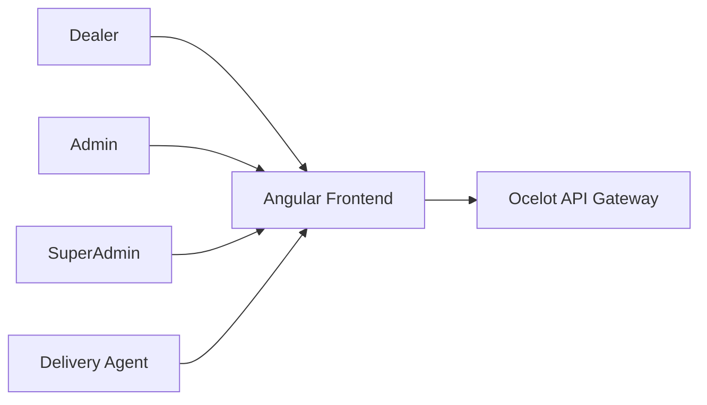
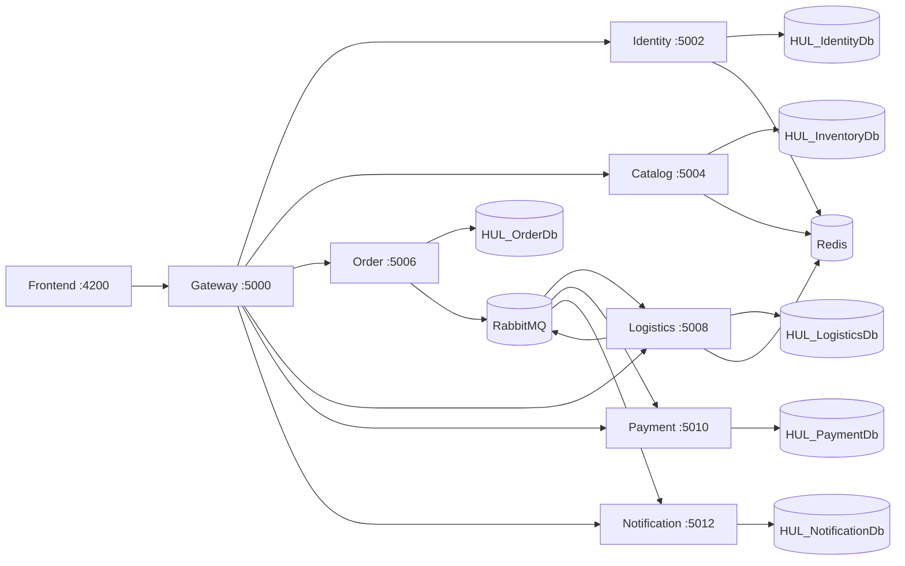
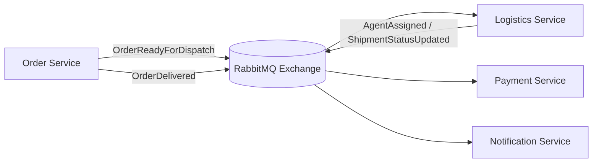

# High-Level Design (HLD)

## 1. Purpose

This document describes the macro-architecture of the HUL Supply Chain Enterprise Portal:

- domain boundaries
- service interactions
- storage and messaging topology
- runtime deployment shape

---

## 2. Architectural Principles

- Bounded context ownership per microservice
- Independent database per service
- API-first service contracts
- Event-driven integration for cross-domain side effects
- Shared cross-cutting platform layer for consistency

---

## 3. System Context

---

## 4. Container View

---

## 5. Service Responsibilities

| Service | Core Responsibility |
|---|---|
| Identity | Authentication, OTP, refresh tokens, dealer governance, shipping addresses |
| Catalog | Products, categories, stock metadata, favorites, subscriptions, reservation integration |
| Order | Order aggregate lifecycle, returns, outbox publication |
| Logistics | Shipment lifecycle, assignment, tracking timeline, SLA monitoring |
| Payment | Credit checks, invoice generation and retrieval |
| Notification | Event-driven email dispatch, templates, inbox and log audit |

---

## 6. Cross-Service Integration Modes

### Synchronous

- Gateway to service APIs
- Selected internal service-to-service calls (JWT authenticated)

### Asynchronous

- Domain events via RabbitMQ topic exchange
- Outbox-driven publish path (order domain)
- Consumer inbox dedupe pattern for idempotent processing

---

## 7. Domain Event Topology

---

## 8. Security Topology

- External traffic enters through Gateway
- JWT bearer authentication for protected routes
- Internal service policy with signed internal tokens
- Audience validation across service identities

---

## 9. Observability Topology

- Request correlation via `X-Correlation-ID`
- Structured logging via shared Serilog setup
- Context enrichment (`ServiceName`, `UserId`, `RequestPath`, `CorrelationId`)
- Correlation propagation to async event envelope

---

## 10. Runtime Environment Summary

| Component | Port |
|---|---:|
| Frontend | 4200 |
| Gateway | 5000 |
| Identity | 5002 |
| Catalog | 5004 |
| Order | 5006 |
| Logistics | 5008 |
| Payment | 5010 |
| Notification | 5012 |

Primary backing stores:

- SQL Server (`.\SQLEXPRESS`)
- Redis
- RabbitMQ

