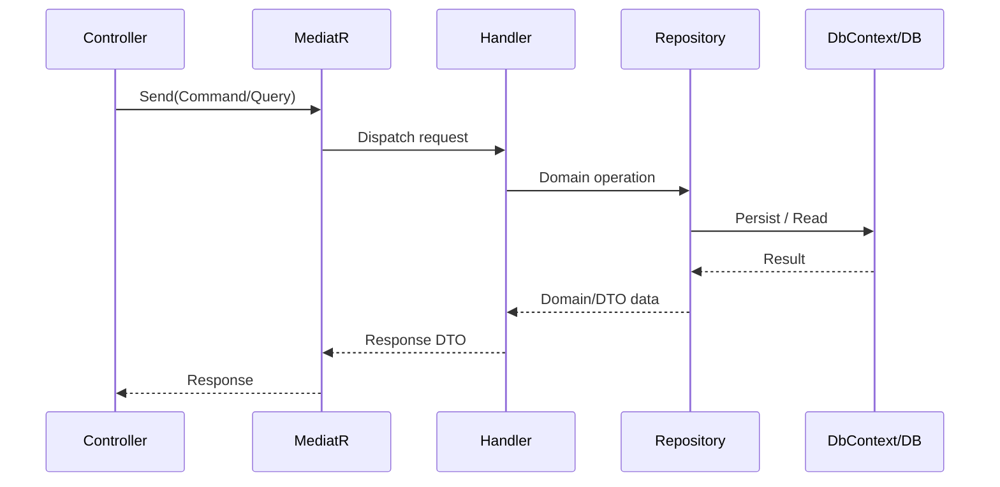

# Low-Level Design (LLD)

## 1. Scope

This document describes implementation-level architecture for backend and frontend components, with emphasis on:

- layering and dependency flow
- request/response pipeline
- command/query execution
- integration clients and consumers
- shared infrastructure internals

---

## 2. Backend Layering Model

Each microservice follows the same dependency direction:

```text
API -> Application -> Domain
API -> Infrastructure -> Domain
Application -> Domain
Infrastructure -> Application abstractions
```

Rules:

- API does not contain business logic
- Domain does not depend on API/Infrastructure
- Application orchestrates use cases via handlers
- Infrastructure implements persistence and external adapters

---

## 3. Request Pipeline (API)

Shared middleware stack (first in pipeline):

1. Correlation ID middleware
2. Rate limiting middleware
3. Request context enrichment middleware
4. Global exception handling middleware
5. CORS
6. Serilog request logging
7. Authentication
8. Authorization
9. Endpoint mapping

Result standardization:

- success results wrapped in standard `ApiResponse<T>` envelope using response filter
- exceptions mapped to standard error envelope by global exception middleware

---

## 4. Shared Infrastructure Components

Path: `src/SharedInfrastructure/SupplyChain.SharedInfrastructure`

### Core Modules

- `Correlation`
  - request correlation creation/propagation
  - outbound header forwarding handler
- `Middleware`
  - global exception middleware
  - response envelope filter
- `Results`
  - `ApiResponse`, `ApiError`, `PaginatedResult`
- `Security`
  - internal token provider and defaults
- `Resilience`
  - standard HttpClient Polly policy extensions
- `Observability`
  - shared Serilog bootstrap
  - log retention cleanup service

---

## 5. CQRS Execution Flow



Validation:

- FluentValidation pipeline behavior executes before handler
- handler receives validated request object

---

## 6. Service-Level Technical Details

## 6.1 Identity Service

Key internals:

- JWT token generation
- OTP issuance and verification
- refresh token hashing/rotation/revocation
- dealer lifecycle actions (approve/reject/suspend/reactivate/delete)
- shipping address management with default-address constraints

Security specifics:

- internal endpoints protected by internal policy
- audience-aware token validation

## 6.2 Catalog Service

Key internals:

- product and category CRUD flows
- favorites and stock subscription APIs
- reservation services backed by Redis keyed structures
- cache invalidation paths for mutating operations

## 6.3 Order Service

Key internals:

- order status state progression
- return request lifecycle
- transactional outbox messages
- scheduled outbox poller + cleanup jobs

Concurrency:

- status transitions guarded in handler/repository flow
- assignment and downstream interactions designed for idempotent behavior

## 6.4 Logistics Service

Key internals:

- shipment creation and assignment
- delivery status updates and tracking event persistence
- SLA monitoring (scheduled jobs)
- `OrderReadyForDispatch` event consumer with dedupe

## 6.5 Payment Service

Key internals:

- credit account and limit management
- invoice generation and retrieval
- `OrderDelivered` event consumer with dedupe

## 6.6 Notification Service

Key internals:

- template-based email rendering and sending
- notification inbox writes
- event consumer with dedupe and dead-letter routing behavior
- notification log retention cleanup

---

## 7. Async Consumer Design

Consumer processing pipeline:

1. read message
2. parse envelope (`eventType`, `eventId`, `correlationId`, `payload`)
3. compute/resolve message identity
4. inbox dedupe check (`ConsumedMessages`)
5. execute use case
6. persist dedupe marker
7. ack success
8. retry or dead-letter on failure according to retry budget

---

## 8. Frontend Internal Design

## 8.1 Module and State Strategy

- role/domain-oriented modules
- NgRx feature slices:
  - auth
  - cart
  - catalog
  - orders
  - shipping addresses

## 8.2 HTTP Interceptors

- zone interceptor
- auth header interceptor
- response envelope interceptor
- error interceptor (includes refresh/retry handling)

---

## 9. Data Access Patterns

- EF Core per-service DbContext
- repository abstractions for core aggregates
- migrations in each service infrastructure project
- unique and filtered indexes for critical integrity rules

---

## 10. Operational Behaviors

- startup migration execution per service
- health check endpoint exposure
- development OpenAPI/Scalar documentation
- service logs written to console and date-partitioned files

---

## 11. Constraints and Boundaries

- CI/CD pipeline definition is out of current scope
- full multi-service containerization is out of current scope
- infrastructure compose currently focuses on Redis and RabbitMQ

