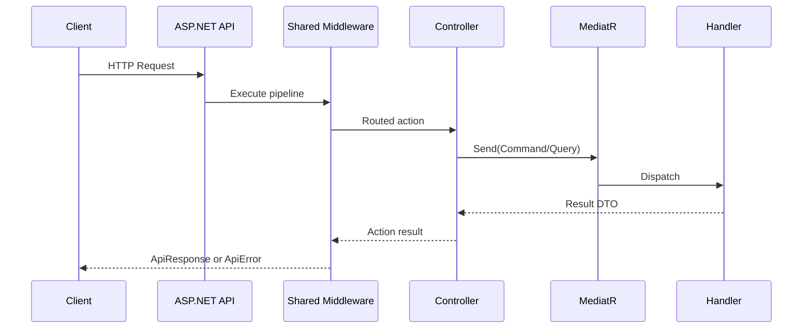
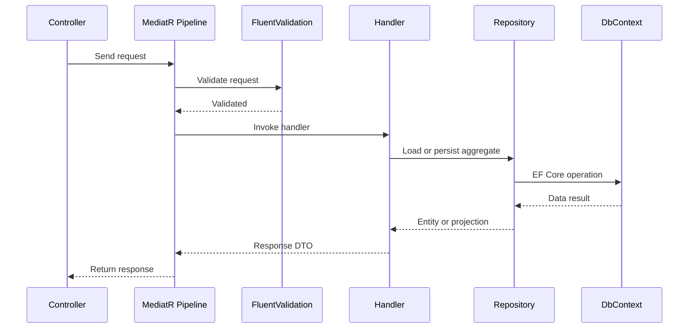
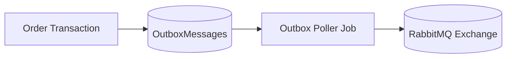

# Low-Level Design (LLD)

## 1. Scope

This document captures implementation-level design of the platform, including:

- backend code structure and runtime pipeline
- CQRS and domain execution flow
- persistence and messaging reliability patterns
- gateway behavior and service communication
- frontend module and API integration patterns

---

## 2. Service Code Architecture

Each backend service follows the same layered model:

```text
API -> Application -> Domain
API -> Infrastructure
Infrastructure -> Application (interfaces)
Application -> Domain
```

Design rules:

- Controllers remain thin and delegate to MediatR requests
- Business rules are implemented in command/query handlers and domain models
- Domain layer has no dependency on API or Infrastructure
- Infrastructure provides EF Core repositories, external clients, and message adapters

---

## 3. Request Processing Pipeline

The HTTP pipeline (in order) is standardized via shared infrastructure:

1. Correlation ID middleware
2. Rate limiting middleware
3. Request context enrichment middleware
4. Global exception middleware
5. CORS
6. Serilog request logging
7. Authentication
8. Authorization
9. Controller endpoint execution

Envelope behavior:

- successful responses are wrapped in `ApiResponse<T>`
- failures are transformed to standard `ApiError` envelope



---

## 4. Shared Infrastructure Internals

Location: `src/SharedInfrastructure/SupplyChain.SharedInfrastructure`

| Module        | Implementation Role                                                   |
| ------------- | --------------------------------------------------------------------- |
| Correlation   | Creates and propagates correlation IDs and outbound headers           |
| Middleware    | Global exception handling and response envelope filter                |
| Results       | Shared DTO contracts (`ApiResponse`, `ApiError`, pagination wrappers) |
| Security      | Internal service token provider and policy helpers                    |
| Resilience    | HttpClient resilience defaults and transient failure handling         |
| Observability | Serilog bootstrap, enrichers, and retention helpers                   |

---

## 5. CQRS and Validation Flow



Key behavior:

- pre-handler validation short-circuits invalid requests
- handlers enforce state transition rules for lifecycle operations
- repositories encapsulate query and persistence concerns

---

## 6. Domain-Specific Technical Design

### 6.1 Identity Service

- JWT access token creation and validation
- OTP registration/login verification
- refresh token rotation and revoke-all support
- admin and super-admin governance endpoints
- shipping address management with default-address control

### 6.2 Catalog Service

- product/category CRUD and activation controls
- favorites and notify-me subscription endpoints
- stock reservation/release flows
- Redis-assisted reservation state and invalidation logic

### 6.3 Order Service

- order placement, approval, cancel, and progression endpoints
- returns workflow and evidence image handling
- transactional outbox table for reliable event publication
- outbox poller and cleanup background jobs

### 6.4 Logistics Service

- shipment creation, assignment, and status transitions
- tracking timeline persistence and query APIs
- delivery agent and vehicle management
- event consumer (`OrderReadyForDispatch`) with dedupe checks

### 6.5 Payment Service

- purchase limit account and monthly cap management
- internal reserve/release operations during order workflow
- invoice generation, listing, download, and sales export
- event consumer (`OrderDelivered`) with dedupe tracking

### 6.6 Notification Service

- template retrieval and update APIs
- user inbox read/unread operations
- event-driven email and inbox writes
- consumed-message dedupe and retention routines

---

## 7. Messaging Reliability Design

### 7.1 Publisher Path (Order Service)



### 7.2 Consumer Path (Logistics/Payment/Notification)

1. Receive event from queue
2. Parse event envelope (`eventId`, `eventType`, `correlationId`, `payload`)
3. Check dedupe table (`ConsumedMessages`)
4. Execute use-case logic
5. Save dedupe marker
6. Acknowledge message
7. Retry and dead-letter on repeated failures

---

## 8. Gateway and Inter-Service Communication

- Ocelot gateway maps upstream routes to service-specific downstream ports
- Correlation header forwarding is enabled for trace continuity
- Gateway-protected routes require bearer token unless explicitly public
- Internal APIs use dedicated internal auth policy and token audiences

---

## 9. Persistence and Data Integrity Patterns

- EF Core DbContext per service boundary
- Repository abstractions around aggregate roots and query projections
- Service-local migrations under each Infrastructure project
- Unique and filtered indexes for consistency-critical scenarios
- State transition guards in handlers to avoid invalid lifecycle changes

---

## 10. Frontend Internal Design

### 10.1 Module and State Organization

- role and feature oriented Angular modules
- NgRx slices around auth, catalog, cart, orders, shipping addresses
- route guards tied to authentication and role claims

### 10.2 API and Error Handling

- interceptor chain for auth header, envelope parsing, and global error handling
- token refresh flow integrated into API retry path
- centralized API base URL and environment-driven configuration

---

## 11. Runtime and Operability Details

- health endpoints exposed per service and gateway
- OpenAPI/Scalar enabled for local API exploration
- structured logs written to console and service log files
- startup checks include configuration, auth settings, and database connectivity

---

## 12. Constraints and Current Boundaries

- CI/CD pipeline specifics are documented separately
- full production container orchestration is outside current local scope
- local compose primarily provisions RabbitMQ and Redis dependencies
